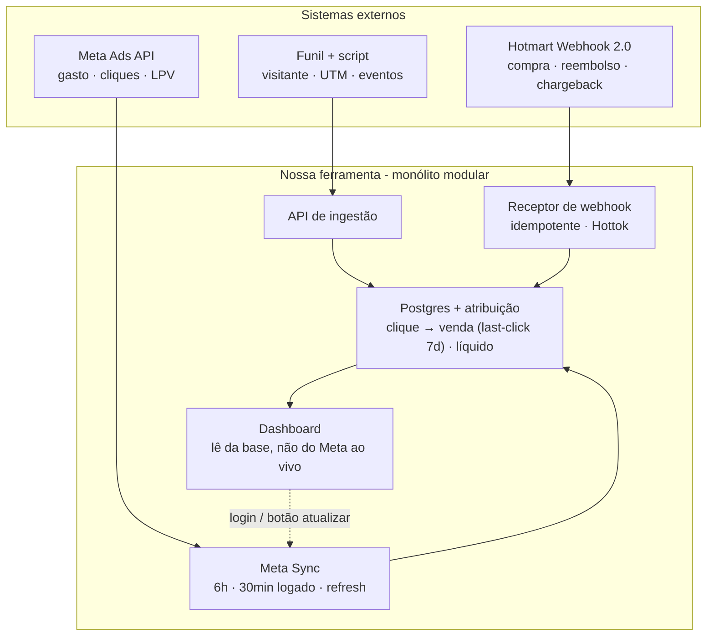

# Sistema de Rastreamento por UTM — Arquitetura + Plano de Ação (v1.1)

> Documento de referência para construção via *vibe coding* com Claude. Cada fase do plano (Seção 11) pode ser colada de volta para o Claude como briefing isolado.
> **Mudanças da v1 → v1.1:** cadência de sync do Meta revisada (ADR-2); tratamento de reembolso/chargeback/cancelamento com métricas líquidas, taxa de reembolso e reembolso por origem (ADR-4); custo/lucro monetário adiado — ROAS como métrica-cabeça ("lucro dos anúncios"); confirmação da integração Hotmart (Seção 5.1) e constraint do `visitor_id` ≤ 30 chars; nota de captura para a futura "Jornada do cliente".

---

## 0. Escopo da v1 — o que entra e o que NÃO entra

| Tipo | Requisito | Na v1? |
|---|---|---|
| **Funcional** | Script de rastreio próprio em todas as páginas do funil | ✅ |
| **Funcional** | Criador de links UTM próprio | ✅ |
| **Funcional** | Identificar origem da venda (tráfego vs orgânico; campanha/conjunto/criativo/público) | ✅ |
| **Funcional** | Integração Meta Ads (gasto, cliques, impressões, LPV, checkouts, compras do Meta) | ✅ |
| **Funcional** | Ingestão de venda via webhook Hotmart (fonte de verdade do faturamento) | ✅ |
| **Funcional** | Reembolso/chargeback/cancelamento deduzem venda + faturamento; taxa de reembolso; reembolso por origem | ✅ |
| **Funcional** | Dashboard: investido, vendas líquidas, faturamento líquido, ROAS + funil (connect rate, ida ao checkout, conv. checkout, conv. funil) | ✅ |
| **Funcional** | Carga automática do Meta no login + a cada 30 min logado + 6h deslogado + botão atualizar | ✅ |
| **Funcional** | Reconciliação "nosso rastreio × Meta" lado a lado | ✅ |
| **Não-funcional** | Faturamento sempre do NOSSO dado (webhook + script), nunca do Meta | ✅ (decisão de design) |
| **Não-funcional** | Dashboard rápido e sempre disponível (mesmo se o Meta cair) | ✅ |
| **Não-funcional** | Operação barata e simples (1 usuário, sem time de infra) | ✅ |
| **Futuro (guardado)** | **Jornada do cliente** (first touch → caminho → touch de conversão) | ❌ v2 — mas **os dados já são capturados agora** (Seção 4) |
| **Futuro (guardado)** | Modelo de custo/lucro monetário (COGS, taxas, impostos) | ❌ v2 |
| **Futuro** | Multi-usuário/multi-cliente, alertas, automações, Google/TikTok, API pública | ❌ v2+ |

**Skip-level:** full-stack (script no browser + backend + dashboard web). Web-first. Uso inicial: só você (multi-usuário é futuro explícito).

---

## 1. Premissas e estimativa de capacidade (back-of-the-envelope)

Confirmado pelo usuário: uso individual no início; o volume previsto abaixo é folgado para o horizonte atual.

**Premissas:** pico ~50.000 page views/dia; ~3 eventos por visitante; vendas dezenas–baixas centenas/dia; 1 conta de anúncio.

| Métrica | Cálculo | Resultado |
|---|---|---|
| Eventos de rastreio/seg (pico 3×) | 50k × 3 ÷ 86.400 × 3 | **~5/s** |
| Armazenamento de eventos/ano | 150k/dia × 365 × ~1 KB | **~55 GB/ano** |
| Chamadas ao Meta/dia | login + 30 min (logado) + 6h (deslogado) + refresh | **dezenas/dia** |
| Webhooks Hotmart/dia | dezenas–centenas | **trivial** |

**Implicações (e o que NÃO fazer):** cabe folgado em **um Postgres gerenciado**. **Sem sharding, sem fila obrigatória, sem NoSQL, sem microservices, sem Kafka** — seria *over-engineering*. O gargalo real é (a) **atribuição** e (b) **rate limit do Meta**, não volume.

---

## 2. Decisões arquiteturais (ADRs)

### ADR-1 — Estilo: monólito modular (não microservices)

- **Contexto:** 1 dev (você + Claude), volume baixo, faturamento exige ACID, custo operacional mínimo.
- **Decisão:** monólito modular (um deployable; módulos por domínio: `tracking`, `meta`, `sales`, `attribution`, `dashboard`; comunicação por função, não rede).
- **Consequências:** (+) deploy único, debugging simples, ACID nativo, custo baixo, ideal p/ vibe coding. (−) escala "tudo junto" (irrelevante neste volume); manter fronteiras de módulo limpas facilita extrair serviços no futuro.
- **Ref.:** Principal §9.7 (1 quantum → monolito), §15 (service-based: ACID prioritário).

### ADR-2 — Sync do Meta: dirigido por sessão + base de 6h + refresh (NÃO ao vivo por page-load) — **revisado**

- **Contexto:** Não há necessidade de dados ao-vivo. A API do Meta tem rate limit por pontos e latência de assentamento. O usuário propôs: 6h deslogado; no login puxa na hora e a cada 30 min enquanto logado; mais o botão refresh.
- **Decisão (endosso com refinamentos):**
  - **Deslogado:** cron a cada **6h** — janela recente (últimos ~7–14 dias), barato, mantém o primeiro paint fresco.
  - **No login:** dispara **fetch imediato incremental**; tela abre com o cache atual na hora e atualiza em background (não bloqueia).
  - **Logado:** re-sync a cada **30 min**, atrelado à **aba ativa/visível** (pausa se a aba some ou após inatividade) para não gastar quota com aba abandonada.
  - **Botão atualizar:** disponível sempre.
  - **Todos** os gatilhos compartilham um **lock** (login + cron + timer + refresh nunca rodam dois ao mesmo tempo) e são **incrementais** por janela recente; resync histórico total é operação rara/manual.
  - Selo **"atualizado há X min"** sempre visível.
- **Consequências:** (+) dashboard rápido e sempre disponível, inclusive com Meta fora; (+) custo de API controlado e baixo; (+) UX boa (cache na hora, fresco em background). (−) dados do Meta com alguns minutos de defasagem — aceitável e transparente. Manter o cron de 6h é "seguro barato" (4 chamadas/dia) e já prepara o terreno multi-usuário; poderia ser removido num cenário 100% single-user, mas o custo é desprezível.
- **Ref.:** System Design §3.8 (rate limiting), §5 (comunicação cliente-servidor); Principal §19 (caching), §34.3/§34.4 (availability/performance tactics).

### ADR-3 — Atribuição: `visitor_id` first-party (curto, ≤30 chars) propagado via `src`/`sck` Hotmart; last-click 7 dias — **revisado**

- **Contexto:** O elo central é ligar clique (UTM) → page view → checkout → compra (webhook). Pesquisa confirmou que a Hotmart devolve, no Webhook 2.0, um objeto `origin` com `sck`/`src`/`xcod` (Seção 5.1) — então **atribuição determinística é possível**. **Constraint crítico:** esses parâmetros têm **limite de ~30 caracteres** e a Hotmart recomenda **minúsculas**.
- **Decisão:**
  - O `t.js` gera um **`visitor_id` curto, minúsculo e URL-safe (≤30 chars)** — ex.: **24 chars hex (96 bits)** ou base36 lowercase. **Não usar UUID padrão** (36 chars) nem base62 mixed-case (risco de normalização para minúsculas pela Hotmart).
  - Persiste em cookie 1st-party + `localStorage`; captura UTMs + `fbclid` + `referrer` no primeiro hit.
  - **Propaga o `visitor_id` ao checkout via `src`** (preferência; `sck`/`xcod` como alternativas — ver Seção 5.1) e **recebe de volta no webhook** (objeto `origin`).
  - **Matching primário:** `origin.src == visitor_id` → determinístico. **Fallback:** hash de e-mail/telefone do comprador casando com visitante que teve `checkout_iniciado` na janela.
  - **Modelo:** last-click dentro de **janela de 7 dias**.
- **Consequências:** (+) atribuição precisa e auditável; (+) funciona mesmo com pixel do Meta bloqueado. (−) depende de injetar/propagar o `src` no checkout Hotmart; (−) cookie perdido/cross-device cai no fallback (menos preciso). Multi-touch fica para a Jornada (v2).
- **Validar no sandbox:** confirmar que o valor de `src`/`sck` (a) aceita ≥24 chars e (b) não é alterado/cortado/forçado a minúsculas. Usar alfabeto lowercase elimina o risco (b).

### ADR-4 — Vendas e reembolsos: webhook idempotente; status líquido deduz venda+faturamento; taxa e origem do reembolso — **revisado**

- **Contexto:** A Hotmart dispara webhook em cada mudança de status, incluindo `REFUNDED`, `CHARGEBACK`, `CANCELLED`, `PARTIALLY_REFUNDED`, `DISPUTE` (Seção 5.1). Reembolso/chargeback/cancelamento **não são compra** e precisam **sair do dashboard**.
- **Decisão:**
  - Webhook **idempotente** (dedupe por `transaction`/`event_id`, *unique constraint*), **autenticado por Hottok**, **ACK 200 rápido**, guarda `raw_payload` + campos parseados.
  - **Ciclo de status do pedido** (`orders.status`): `approved`/`complete` contam como venda; `refunded`/`chargeback`/`cancelled` **removem** a venda **e** o faturamento; `partially_refunded` **reduz o faturamento** pelo valor estornado e **mantém a conversão**.
  - **Contabilidade por coorte (restatement):** o reembolso **deduz da data/origem da venda original** (não da data do reembolso). Assim o ROAS por criativo reflete o líquido real — que é o objetivo da ferramenta. Trade-off: números de períodos passados podem mudar conforme reembolsos chegam (normal em contabilidade líquida).
  - **Reembolso herda a atribuição** do pedido original → aparece automaticamente por campanha/conjunto/criativo.
  - **Métricas novas:** taxa de reembolso geral (por contagem e por valor) e taxa de reembolso por origem.
- **Consequências:** (+) faturamento confiável e líquido; (+) visão de qualidade do tráfego (criativo que vende e não reembolsa > criativo que só vende); (+) reprocessável via `raw_payload`. (−) restatement exige recálculo de coortes (barato neste volume); (−) eventos podem chegar dias depois — tratado pelo log de eventos.
- **Ref.:** Database Internals §12.3 (schema evolution), §12.4.

---

## 3. Arquitetura de alto nível

| Componente | Papel | Onde roda |
|---|---|---|
| **Script de rastreio** (`t.js`) | Gera `visitor_id` (≤30 chars), captura UTM/`fbclid`, envia eventos, injeta `src` no checkout | Browser (todas as páginas do funil); servido da edge/CDN |
| **API de ingestão** | Recebe eventos; grava `visitors` + `tracking_events` + `touchpoints` | App (monólito) |
| **Receptor de webhook** | Recebe Hotmart; idempotente; valida Hottok; grava `orders` + `order_events` | App (monólito) |
| **Meta Sync** | Cron 6h + 30 min logado + on-demand; Marketing API; grava `meta_insights_daily` + hierarquia | App (job/worker) |
| **Motor de atribuição** | Junta clique→venda (last-click 7d); propaga atribuição a reembolsos | App (módulo) |
| **Postgres** | Fonte única de dados | Banco gerenciado |
| **Dashboard** | Lê da base; métricas líquidas + funil + reembolso + reconciliação Meta×nosso; refresh + freshness | App (frontend) |

**Read/write:** mesmo Postgres; dashboard lê de **views/tabelas de rollup** (agregados líquidos por anúncio/dia) para leitura rápida.

---

## 4. O coração — stitching de identidade, atribuição e captura para a Jornada (deep dive)

1. **Clique no anúncio** → URL de destino com UTMs + `fbclid`.
2. **Primeiro hit na landing** → `t.js`: gera `visitor_id` (≤30 chars, lowercase) se não existir; persiste (cookie 1st-party + `localStorage`); grava **touchpoint** (UTM + `fbclid` + `referrer` + ts); envia `pageview`.
3. **Cada página do funil** → `pageview`; **checkout** → `checkout_iniciado`. Mesmo `visitor_id`. Novos touchpoints sempre que houver UTM/`fbclid`.
4. **Propagação ao checkout (crítico):** `t.js` injeta o `visitor_id` no **`src`** do link/checkout Hotmart (ver Seção 5.1).
5. **Compra/estorno** → webhook Hotmart com `transaction`, valor, status, comprador e `origin.src` (= `visitor_id`).
6. **Matching:** primário por `origin.src == visitor_id`; fallback por hash de contato dentro da janela.
7. **Last-click 7d:** entre os touchpoints do `visitor_id`, escolhe o último com UTM/`fbclid` na janela → origem da venda (pago/orgânico, campanha/conjunto/criativo/público).

**Captura para a Jornada do cliente (v2):** a tabela `touchpoints` guarda **a sequência ordenada completa** de todos os toques por visitante. Hoje só lemos o último (last-click); a Jornada (first touch → caminho → conversão) será uma **feature de leitura** sobre os mesmos dados — **sem migração nem perda**, desde que comecemos a gravar agora.

**Casos de borda:**

| Caso | Efeito | Mitigação v1 |
|---|---|---|
| Cookie/`localStorage` perdido | Quebra elo determinístico | Fallback por contato; recapturar UTM por página |
| Cross-device | `visitor_id` diferente | Só fallback por contato (limitação conhecida) |
| Ad-block / consentimento nega script | Sub-rastreio vs Meta | Esperado; reconciliação evidencia o gap |
| `fbclid` sem UTM | Origem ambígua | Tratar como pago do Meta via `fbclid` |
| Orgânico (sem UTM/`fbclid`) | — | Classificar por `referrer` |

---

## 5. Integração com Meta Ads (deep dive)

**Por que não é ao vivo:** rate limit por pontos + latência de insights → sync + cache (ADR-2).

**Mecânica do sync:** Insights por conta no nível **ad** (criativo), com breakdown campanha/conjunto/anúncio. Campos: `spend`, `impressions`, `clicks`/`link_clicks`, `landing_page_views`, `initiate_checkout`, `purchases` (do Meta) + hierarquia (campanha→conjunto→anúncio→público). Upsert em `meta_insights_daily` por `ad_id`+`date`.

**Táticas de resiliência (Principal §34.3/§34.4):** retry com backoff; degradation (servir último sync com aviso se Meta cair); timestamp (`synced_at` → "atualizado há X min"); respeitar pontos/paginar; detectar token expirado → sinalizar reauth. **Token (System User) só no servidor**, nunca no client.

### 5.1 Integração Hotmart — confirmado por pesquisa

| Item | Achado | Implicação |
|---|---|---|
| Webhook 2.0 (Postback) | Notifica a cada mudança de status (compra, reembolso, cancelamento de assinatura) | Mecanismo de ingestão de venda |
| Objeto `origin` no payload | Webhook 2.0 inclui `origin` com `sck`, `src`, `xcod` | **Atribuição determinística viável** — carregamos o `visitor_id` no `src` |
| Status disponíveis | `APPROVED, BLOCKED, CANCELLED, CHARGEBACK, COMPLETE, EXPIRED, NO_FUNDS, OVERDUE, PARTIALLY_REFUNDED, PRE_ORDER, PRINTED_BILLET, PROCESSING_TRANSACTION, PROTESTED, REFUNDED, STARTED, UNDER_ANALISYS, WAITING_PAYMENT` | Mapeia direto o ADR-4 (líquido + parcial) |
| Limite dos parâmetros | `src`/`sck` aceitam códigos de **até ~30 caracteres**, recomendados em **minúsculas** | `visitor_id` deve ser **≤30 chars, lowercase, URL-safe** (ex.: 24 hex) |
| Autenticação | Cada conta tem um **Hottok** enviado no payload | Validar Hottok no receptor |
| Confiabilidade | Re-tentativas automáticas até 5×; histórico 60 dias | **Idempotência obrigatória** |
| Referência | `src` aparece também na Sales History API; ferramentas como UTMify/VTurb reconciliam via esses parâmetros no webhook | Padrão validado pelo mercado |

> **A validar no sandbox da Hotmart:** comprimento máximo exato e tratamento de caixa do `src`/`sck`; nome/forma exatos dos campos do objeto `origin` na sua conta. Usar `visitor_id` lowercase de 24 chars é a aposta mais segura.

---

## 6. Modelo de dados (Postgres)

Tudo SQL/relacional (ACID + joins de atribuição/funil).

| Tabela | Campos-chave | Notas |
|---|---|---|
| `funnels` | `id`, `name`, `domain` | — |
| `ad_accounts` | `id`, `meta_account_id`, `token_ref` | Token em secret store |
| `campaigns`/`adsets`/`ads` | `id`, `meta_id`, `name`, FK pai, `audience` | Espelho do Meta |
| `visitors` | `visitor_id` (PK, ≤30 chars lowercase), `first_touch`, `last_touch`, `contact_hash` | Índice em `contact_hash` |
| `touchpoints` | `id`, `visitor_id` (FK), `utm_*`, `fbclid`, `referrer`, `page`, `ts` | **Substrato do last-click e da Jornada futura**; índice (`visitor_id`,`ts`) |
| `tracking_events` | `id`, `visitor_id` (FK), `type` (pageview/checkout_iniciado), `funnel_id`, `url`, `ts` | Índices (`visitor_id`,`ts`), (`type`,`ts`) |
| `orders` | `id`, `transaction` (**unique**), `visitor_id` (FK, nullable), `contact_hash`, `gross_value`, `refunded_value`, `net_value`, `status`, `raw_payload`, `created_at` | Idempotência por `transaction`; `net_value` = `gross_value − refunded_value` |
| `order_events` | `id`, `order_id` (FK), `type` (approved/refunded/chargeback/partial...), `value`, `ts` | **Append-only** → reembolso ao longo do tempo, parciais, auditoria |
| `meta_insights_daily` | `ad_id` (FK), `date`, `spend`, `impressions`, `clicks`, `lpv`, `ic`, `purchases`, `synced_at` | **Unique (`ad_id`,`date`)**; upsert |
| `attributions` | `order_id` (FK), `ad_id`/origin, `model` (last_click_7d), `match_type` (deterministic/fallback) | Reembolso usa a atribuição do pedido |
| `dashboard_rollup` (view/materializada) | por `ad_id`+`date`: investido, vendas líq., faturamento líq., ROAS, funil, reembolso | Leitura rápida |

**Idempotência:** `unique(transaction)` em `orders` e `unique(ad_id,date)` em `meta_insights_daily`.

---

## 7. Métricas — definições (validadas com o usuário)

### Centrais (em evidência)

| Métrica | Fórmula | Fonte |
|---|---|---|
| Investido | Σ `spend` | Meta |
| Vendas (líquidas) | nº de pedidos `approved/complete` **menos** os revertidos | **Hotmart** (status) |
| Faturamento (líquido) | Σ `net_value` (bruto − estornos) | **Hotmart** |
| **ROAS** ("lucro dos anúncios") | Faturamento líquido ÷ Investido | Misto |

> Em v1, **"lucro dos anúncios" = ROAS** (multiplicador, ex.: 3,2×). Lucro monetário real (com COGS/taxas/impostos) fica para v2 com o modelo de custo.

### Reembolso (visível)

| Métrica | Fórmula |
|---|---|
| Taxa de reembolso (contagem) | Pedidos revertidos ÷ pedidos pagos (na coorte da venda) |
| Taxa de reembolso (valor) | Valor estornado ÷ faturamento bruto |
| Reembolso por origem | As fórmulas acima filtradas por campanha/conjunto/criativo (herda atribuição) |

### Funil

| Métrica | Fórmula | Lê de |
|---|---|---|
| Connect rate | Page views (nosso) ÷ Cliques no link (Meta) | Nosso + Meta |
| Taxa de ida ao checkout | `checkout_iniciado` ÷ Page views | Nosso |
| Conversão do checkout | Compras líquidas ÷ `checkout_iniciado` | Nosso |
| Conversão do funil | Compras líquidas ÷ Page views | Nosso |

### Reconciliação "nosso × Meta"
Lado a lado por anúncio: LPV/checkout/compras **do Meta** vs pageview/checkout_iniciado/compras **do nosso script**. Diferença = diagnóstico (ad-block, perda de cookie, atraso de webhook). Venda/faturamento de verdade = **sempre o nosso** (ADR-4).

---

## 8. Dashboard e atualização — mecânica (System Design §5)

| Aspecto | Decisão v1 | Trade-off |
|---|---|---|
| Origem dos dados | Sempre da base (rollup líquido) | Rápido e sempre disponível; minutos de defasagem (selo) |
| No login | Abre com cache na hora + fetch incremental do Meta em background | Não bloqueia a tela |
| Logado | Re-sync 30 min (aba ativa) | Frescor sem desperdício de quota |
| Botão "atualizar" | `POST /sync` síncrono (spinner) | Simples; evoluir p/ SSE (progresso) depois |
| Tempo real | **Não usar WebSockets** | Sem fluxo bidirecional real; evita complexidade |

---

## 9. Stack recomendada para vibe coding

Você já tem **Vercel** e **Supabase** conectados — caminho natural.

| Camada | Recomendação | Trade-off |
|---|---|---|
| App (front + back) | **Next.js (App Router)** = monólito modular | Um repo/deploy; ótimo p/ Claude. (−) funções serverless têm limite de tempo → sync do Meta pagina e roda como job/edge function |
| Banco + Auth | **Supabase** (Postgres + Auth + Edge Functions + Cron) | Postgres gerenciado, login pronto, cron p/ os 6h. (−) limites de plano em jobs longos |
| Deploy | **Vercel** | CI/CD trivial |
| Script de rastreio | **JS vanilla minúsculo** na edge/CDN | Latência baixa, cacheável |
| Meta | **Marketing API** via SDK no servidor | Token só no servidor |
| Hotmart | **Webhook 2.0** → receptor com validação de Hottok | Idempotência por `transaction` |

> Sem Docker/Kubernetes nesta v1.

---

## 10. Gargalos e riscos (System Design §7; Principal §26)

| Risco | Severidade | Mitigação |
|---|---|---|
| `visitor_id` não cabe/é alterado no `src` Hotmart | **Alta** | ID ≤30 chars lowercase; validar no sandbox antes da Fase 3 |
| Estouro de rate limit do Meta | **Alta** | Sync por sessão + cache; lock; backoff; incremental |
| Perda de elo (cookie/cross-device) | **Alta** | Propagar `src`; fallback por contato; recapturar UTM por página |
| Reembolso fora da coorte / atraso | Média | `order_events` append-only; restatement por coorte |
| Sub-rastreio por ad-block | Média | Esperado; reconciliação evidencia o gap |
| Webhook duplicado (até 5 retries) | Média | Idempotência por `transaction` |
| Token Meta expira | Média | Detecção + sinal de reauth |
| Fuso/janela inconsistente | Média | Fixar timezone do negócio; janela 7d documentada |
| SPoF (um app/um banco) | Baixa (neste volume) | Backups Supabase; deploy redundante Vercel |

---

## 11. Plano de ação por fases

### Fase 0 — Fundação
- **Entregáveis:** repo Next.js; projeto Supabase; schema (Seção 6); Auth (só você); deploy Vercel; segredos.
- **DoD:** app no ar, login funciona, tabelas criadas, migration versionada.

### Fase 1 — Rastreio (script + ingestão)
- **Entregáveis:** `t.js` (gera `visitor_id` ≤30 chars lowercase, captura UTM/`fbclid`, grava touchpoints, envia eventos, **injeta `src` no checkout Hotmart**); `POST /collect`; snippet de instalação.
- **DoD:** abrir o funil gera `visitors`/`touchpoints`/`tracking_events` corretos; UTMs persistem; `src` chega no link do checkout.

### Fase 2 — Vendas + reembolsos (webhook Hotmart)
- **Entregáveis:** `POST /webhook/hotmart` idempotente, validação de **Hottok**, `raw_payload`; ciclo de status (approved→refunded/chargeback/cancelled/partial); `orders` + `order_events`; `net_value`.
- **DoD:** compra de teste cria `order`; reenvio **não duplica**; evento de reembolso zera `net_value` e remove a venda; parcial reduz valor e mantém conversão.

### Fase 3 — Atribuição (o coração)
- **Entregáveis:** matching determinístico (`origin.src == visitor_id`) + fallback por contato; last-click 7d; `attributions`; **propagação da atribuição ao reembolso**.
- **DoD:** venda de teste com UTM conhecida atribui ao criativo certo; reembolso aparece sob o mesmo criativo; venda sem `src` casa pelo fallback.

### Fase 4 — Integração Meta
- **Entregáveis:** OAuth/token (System User, server-side); Meta Sync (cron 6h + timer 30 min logado + on-demand) com lock/backoff/incremental; `meta_insights_daily` + hierarquia; `synced_at`.
- **DoD:** insights populando; re-sync não duplica; login dispara fetch imediato; 30 min em sessão ativa.

### Fase 5 — Dashboard
- **Entregáveis:** `dashboard_rollup`; cartões (investido, vendas líq., faturamento líq., ROAS); **taxa de reembolso** + **reembolso por origem**; funil; **reconciliação Meta×nosso**; botão atualizar + selo de freshness; carga automática no login.
- **DoD:** números batem com Meta + Hotmart num período de teste; reembolso reduz os números da coorte certa; botão atualiza e mostra "atualizado há X min".

### Fase 6 — Endurecimento
- **Entregáveis:** rate limiting na ingestão; retries/backoff; degradation (Meta fora → dashboard abre com aviso); logs/monitoramento; backups verificados.
- **DoD:** Meta fora → dashboard ainda abre; picos de evento não derrubam ingestão.

---

## 12. Decisões — status

| # | Tema | Decisão |
|---|---|---|
| 1 | Volume / multi-usuário | Single-user agora; premissas da Seção 1 OK; multi-usuário é v2 |
| 2 | Atribuição | Last-click, janela 7 dias. **Jornada do cliente = v2** (dados já capturados em `touchpoints`) |
| 3 | Custo/lucro monetário | **Adiado (v2).** v1 usa ROAS como "lucro dos anúncios" |
| 4 | Métricas de funil | Confirmadas (Seção 7) |
| 5 | Plataforma de venda | **Hotmart.** Webhook 2.0 com objeto `origin` (`src`/`sck`/`xcod`) → atribuição determinística viável (Seção 5.1) |
| 6 | Contas de anúncio | 1 conta na v1 |
| 7 | Frescor do Meta | 6h deslogado · fetch no login · 30 min logado (aba ativa) · botão refresh (ADR-2) |

**Aberto / a validar:**
- **(A) Sandbox Hotmart:** confirmar comprimento e caixa de `src`/`sck` e a forma exata do objeto `origin` na sua conta (faz parte da Fase 2/3).
- **(B) Reembolso parcial:** confirmado o padrão (reduz faturamento, mantém conversão)? *(Sigo com esse padrão salvo indicação contrária.)*
- **(C) Restatement por coorte:** confirmado que reembolso deduz da data/origem da venda original (e não da data do reembolso)? *(Padrão adotado: sim — alinha o ROAS por criativo.)*

---

*Quando começar uma fase, cole a seção dela aqui no chat que eu detalho schema, código e instalação passo a passo.*
