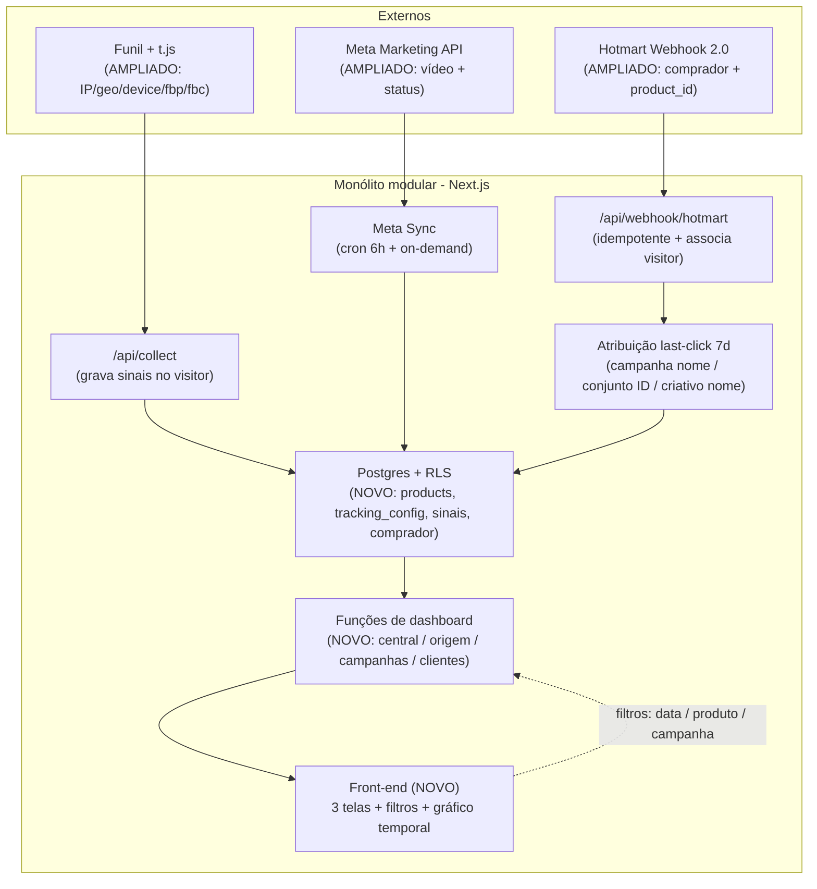

# Arquitetura V2 — Sistema de Rastreamento por UTM

> Documento de arquitetura **fechado e executável**, escrito para o **Claude Code** implementar em cima do repositório existente (`rastreamento-utm`).
> Leia também, no repo: `CLAUDE.md` (regras de ouro), `PROGRESSO.md` (estado da v1) e `arquitetura-rastreamento-utm-v1.md` (desenho v1, fonte de verdade da base). **Em conflito, este documento manda para a v2.**
> Princípio central: a v2 **estende** a v1 (mesma stack, mesmo monólito modular, mesmo Postgres) — **migrations aditivas, nada de reescrever do zero, não quebrar dados reais em produção.**

---

## 1. Contexto e postura

- **Uso interno (1 usuário).** SaaS/multi-usuário fica para v3–v5 — fora de escopo.
- **A v2 só MOSTRA dados:** zero automação, alertas ou ações. Foco em clareza de dados, refino de front-end e atribuição mais robusta.
- Convivência com o **Dash fácil** mantida. Privacidade **mínima**; dados guardados **crus** (uso interno).
- Stack mantida: **Next.js (App Router) + Supabase (Postgres/Auth/Edge/Cron) + Vercel**. Monólito modular. (Ref.: Principal §9.7, §15 — 1 quantum, ACID prioritário, custo operacional mínimo.)

---

## 2. Capacidade (back-of-envelope) — confirma "sem nova infra"

Volume real medido na v1: ~35+ visitantes, 769 insights/15 dias, dezenas de vendas. Mesmo com a captura ampliada e 3–4 meses de histórico, o banco fica em **dezenas–baixas centenas de MB** → cabe folgado no **plano gratuito do Supabase**. (Ref.: System Design §2.)

**Implicação:** nada de sharding, fila, NoSQL, microservices ou cache distribuído. O dashboard lê de **rollups/funções** no Postgres (rápido), mantendo a regra de ouro "lê do nosso banco, nunca do Meta ao vivo" (Ref.: Principal §19 caching; System Design §3, §5).

---

## 3. Decisões arquiteturais (ADRs v2)

Formato: Contexto → Decisão → Trade-off → Ref.

**ADR-v2-1 — ROAS global dos selecionados.**
- *Contexto:* clareza de ROAS por produto sem mistura.
- *Decisão:* ROAS = faturamento (apenas dos **produtos selecionados**, **total de todos**) ÷ gasto (apenas das **campanhas selecionadas** por tag). Sem entidade "funil" amarrando campanha↔produto. Clareza por produto = **filtrar 1 produto + as campanhas dele**.
- *Trade-off:* simples e flexível; (−) se selecionar vários produtos/campanhas ao mesmo tempo, mistura — resolvido pelo ato de filtrar.

**ADR-v2-2 — Produtos por `product_id` + campanhas por TAG.**
- *Decisão:* duas seleções independentes — **produtos** via registry por `product_id` (Hotmart) com **papel** (principal/order_bump/upsell/downsell/other) e flag `included`; **campanhas** via match de **TAG no nome** do Meta.
- *Trade-off:* product_id é estável (robusto); tag de campanha depende de disciplina de nomenclatura (flag de risco em §10).

**ADR-v2-3 — Armazenar PII cru (reverte o "sem PII" da v1).**
- *Decisão:* guardar e-mail/telefone/endereço do comprador e sinais do visitante (IP/geo/device) **crus**.
- *Trade-off:* habilita enriquecimento e futuro match cross-device; (−) PII em repouso — mitigado por **RLS server-only** (acesso só via service_role), **retenção curta** e uso interno. (Ref.: Database Internals §12.3 — armazenar payload + campos parseados.)

**ADR-v2-4 — Captura ampliada + associação comprador↔visitante.**
- *Decisão:* priorizar sinais do **Meta** (`fbclid`/`fbp`/`fbc`) + IP, geo (por IP), device/UA, `visitor_id`. Na conversão, **associar os dados do comprador (webhook) ao `visitor_id`**, enriquecendo o perfil. Contato ainda **vem do webhook** (não capturado no funil nesta v2).
- *Trade-off:* atribuição muito mais robusta; (−) mais campos no `/collect` e no webhook; depende de o pixel do Meta existir na página para `fbp`/`fbc`.

**ADR-v2-5 — Hierarquia de atribuição: campanha (nome) + conjunto (ID) + criativo (nome).**
- *Decisão:* `utm_campaign`=nome→`campaigns.name`; `utm_term`=**ID**→`adsets.meta_id`; `utm_content`=slug→`ads.name`. `utm_content={{ad.id}}` **adiado**.
- *Trade-off:* conjunto por ID é à prova de renomeação; campanha/criativo por nome quebram se renomeados no Meta (flag em §10).

**ADR-v2-6 — Retenção 3–4 meses com poda seletiva.**
- *Decisão:* podar **eventos brutos** (`tracking_events`, `touchpoints`) com mais de ~120 dias; **manter `orders` e os agregados diários** (pequenos e valiosos — são venda real e a base do gráfico temporal).
- *Trade-off:* fica grátis e o gráfico de 3–4 meses funciona; (−) jornada/detalhe bruto além de ~4 meses se perde (aceito; a Jornada é v-futuro).

**ADR-v2-7 — Multi-tela lendo de rollups.**
- *Decisão:* 3 telas (Central, Origem das UTMs, Campanhas) lendo de **funções/rollups** no Postgres; mantém degradação e selo de freshness da v1.
- *Trade-off:* leitura rápida e sempre disponível; (−) números podem ter minutos de defasagem do Meta (já transparente). (Ref.: Principal §34.3/§34.4.)

**ADR-v2-8 — Sync do Meta ampliado (vídeo + status).**
- *Decisão:* puxar métricas de **vídeo** (3s, p75, p95, plays), `link_clicks` e **status/veiculação** (`effective_status`), além do que a v1 já traz.
- *Trade-off:* mais campos e um pouco mais de cota por chamada; resiliência (retry/backoff) da v1 reutilizada. (Ref.: System Design §3.8.)

**ADR-v2-9 — Reconciliação Meta×nosso adiada.**
- *Decisão:* nas métricas que existem nos dois lados (LPV, initiate checkout, compras), o dashboard usa **os nossos números**. A tela de diferença Meta×nosso fica para versão futura.
- *Trade-off:* funil internamente coerente com a atribuição; (−) sem comparação visual nesta v2 (anotado no parking lot).

---

## 4. Visão de arquitetura (componentes)

Reaproveita 100% da topologia da v1. **Novo/ampliado em destaque.**

**Módulos do código (mantém a separação por domínio):** `lib/tracking`, `lib/meta`, `lib/sales`, `lib/attribution`, `lib/supabase`, `app/(dashboard)` (telas), `app/api/*`.

---

## 5. Modelo de dados (alvo + migrations)

**Regras de migration:** Claude Code **lê primeiro** as migrations existentes (`0001`→`0014`) e o schema real; escreve **novas migrations a partir de `0015`**, **aditivas** (`ADD COLUMN IF NOT EXISTS`, `CREATE TABLE IF NOT EXISTS`); **RLS ligado, sem política pública** em toda tabela nova (padrão da v1); **search_path fixo** nas funções novas (padrão migration 0014). **Nunca** apagar/reescrever dado real.

### Tabelas novas

| Tabela | Colunas-chave | Papel |
|---|---|---|
| `products` | `product_id` (PK, Hotmart), `name`, `role` (enum: `principal`/`order_bump`/`upsell`/`downsell`/`other`), `included` (bool, default false) | Registry de produtos: seleção + papel |
| `tracking_config` | `id` (single-row), `campaign_name_tags` (text[]), `retention_days` (int, default 120) | Seleção de campanhas por tag + retenção |
| `customers` *(VIEW)* | derivada de `orders` por `buyer_email` | Consolida cliente p/ a Tela 2 (1 linha por e-mail) |

### Colunas a adicionar (tabelas existentes)

| Tabela | Adicionar |
|---|---|
| `visitors` | `ip` (text), `geo_country`/`geo_region`/`geo_city` (text), `user_agent` (text), `device_type` (text), `fbp` (text), `fbc` (text) |
| `touchpoints` | (já tem `utm_*`/`fbclid`/`referrer`) — garantir `utm_term` populando com **ID do conjunto** |
| `orders` | `product_id` (text, FK lógica → `products`), `buyer_email`/`buyer_name`/`buyer_phone`/`buyer_document` (text), `buyer_address` (jsonb) — **crus** |
| `campaigns` / `adsets` / `ads` | `effective_status` (text — veiculação) |
| `meta_insights_daily` | `link_clicks` (int), `video_3s` (int), `video_p75` (int), `video_p95` (int), `video_plays` (int) |
| `attributions` | garantir resolução de `campaign`/`adset_id`/`creative` (campanha por nome, conjunto por ID via `utm_term`→`adsets.meta_id`, criativo por nome via `utm_content`→`ads.name`) |

### Funções de leitura (dashboards) — novas/estendidas
Todas: parametrizadas por `(date_from, date_to)` + filtro de **produtos selecionados** (`products.included`) e **campanhas** (match de `tracking_config.campaign_name_tags`); **líquidas + coorte + fuso America/Sao_Paulo**; revogadas de `anon`/`authenticated`, lidas via `admin` atrás do login (padrão v1).
- `central_summary(date_from,date_to)` — todas as métricas-cabeça + faturamento por papel.
- `central_timeseries(date_from,date_to)` — diário: gasto, faturamento, lucro, roas.
- `origem_overview(date_from,date_to)` — rastreadas/não, organic/meta, por source/medium.
- `customers_list(date_from,date_to)` + `customer_history(buyer_email)` — tabela e expansão da Tela 2.
- `campaigns_table(level, parent_id, date_from, date_to)` — tabela estilo gerenciador por nível (`campaign`/`adset`/`creative`) com **todas as colunas** (§8.3), incluindo **reembolso por origem**.
- `creatives_consolidated(date_from,date_to)` — tabela secundária por nome de criativo (across campanhas).

---

## 6. Mudanças por componente

### 6.1 Rastreio — `public/t.js` + `app/api/collect`
- `t.js`: além do que já faz (visitor_id 24-hex, UTM/`fbclid`, eventos, injeção de `src`), capturar **device/user-agent** e ler cookies **`_fbp`/`_fbc`** (se o pixel do Meta estiver na página) e enviá-los. Manter respeito a **DNT** (v1).
- `/api/collect`: capturar **IP** e **geo por IP** **server-side** (nunca confiar no client p/ IP); gravar `ip`/`geo_*`/`user_agent`/`device_type`/`fbp`/`fbc` em `visitors` (preservando `first_touch`). Manter rate limit e allow-list.

### 6.2 Webhook — `app/api/webhook/hotmart` + `lib/sales`
- Manter Hottok timing-safe, idempotência por `transaction`, RPC `apply_hotmart_event`, líquido + restatement por coorte (v1).
- **Novo:** persistir `product_id` + dados do comprador **crus** em `orders`; **associar** o `visitor_id` (via `origin.src`) e, quando casar, **enriquecer** o perfil do visitante com o e-mail do comprador (base do futuro match cross-device).
- Cada transação = 1 produto (order bump/upsell/downsell vêm como transações próprias, cada uma com seu `product_id` e `origin`).

### 6.3 Atribuição — `lib/attribution`
- Manter last-click 7d determinístico + fallback por contato (agora alimentável pela associação do webhook).
- **Resolver os 3 níveis:** campanha (nome), **conjunto (ID via `utm_term`)**, criativo (nome). Reembolso herda a atribuição (v1).

### 6.4 Sync do Meta — `lib/meta`
- Ampliar `client.ts` para puxar `link_clicks` + vídeo (`video_3s`, `video_p75`, `video_p95`, `video_plays`) + `effective_status` (campanha/conjunto/anúncio). Manter `7d_click`, paginação, lock, retry/backoff. Upsert em `meta_insights_daily` (+ status nas tabelas de hierarquia).

### 6.5 Camada de dados do dashboard
- Construir as funções de §5. **Reaproveitar e estender** as funções da v1 (`dashboard_summary`, `dashboard_by_campaign`, `dashboard_by_creative`) em vez de reinventar.
- **Funil por dimensão de UTM:** os eventos (`pageview`, `checkout_iniciado`) atribuem-se à campanha/conjunto/criativo do **touchpoint** que carregou a UTM (mesma lógica de last-click), para connect rate / taxa de ida ao checkout / conversões por nível.

### 6.6 Retenção/poda
- Job **pg_cron** diário: apagar `tracking_events`/`touchpoints` com `ts < now() − tracking_config.retention_days`. **Não** podar `orders` nem agregados diários. Verificar uso vs. limite do plano grátis.

---

## 7. Definições canônicas de métrica (fonte única)

| Métrica | Fórmula | Fonte |
|---|---|---|
| Investido | Σ `spend` (campanhas selecionadas) | Meta |
| Faturamento | Σ `net_value` (produtos selecionados, todos) | Hotmart |
| Lucro | Faturamento − Investido | misto |
| ROAS | Faturamento total ÷ Investido | misto |
| Custo por venda / por compra (CAC) | Investido ÷ nº de vendas (total) | misto |
| Custo por venda (principal) | Investido ÷ nº de vendas do principal | misto |
| Nº de vendas (total) | pedidos pagos líquidos | Hotmart |
| Nº de vendas (principal) | pedidos com produto de papel `principal` | Hotmart |
| Ticket médio | Faturamento líquido ÷ nº de vendas | Hotmart |
| Taxa de reembolso | reembolsos ÷ pedidos pagos (coorte) | Hotmart |
| Connect rate | page views (nosso) ÷ cliques no link (Meta) | misto |
| Taxa de ida ao checkout | `checkout_iniciado` ÷ page views | nosso |
| Conversão do checkout | compras ÷ `checkout_iniciado` | nosso |
| Conversão do funil | compras ÷ page views | nosso |
| Hook Rate | views de 3s ÷ impressões | Meta |
| Retenção da narrativa | reproduções de 75% ÷ reproduções do vídeo | Meta |
| CTR da chamada para ação | cliques no link ÷ reproduções de 95% | Meta |
| CTR padrão | cliques no link ÷ impressões | Meta |
| Taxa de compra sobre clique | compras ÷ cliques no link | misto |
| CPM / CPC | gasto÷impressões×1000 / gasto÷cliques no link | Meta |

*(clique = sempre clique no link. Métricas de vídeo ficam vazias em anúncio estático. LPV/initiate checkout/compras usam os NOSSOS números.)*

---

## 8. Especificação das telas + critérios de aceitação

Filtros transversais às 3 telas: **data sob medida** (dia + intervalo livre), **produtos** (selecionados), **campanhas** (por tag). Filtros **persistem** entre telas.

### 8.1 Tela Central
Layout: cartões → bloco "faturamento por papel" → funil visual → gráfico temporal → reembolso cru.
- Cartões: Investido, Faturamento, Lucro, ROAS, Custo por venda (total + principal), Taxa de reembolso, Ticket médio, Nº de vendas (total + principal).
- **Bloco resumido "faturamento por papel"**: principal / order bump / upsell / downsell / outros.
- Funil visual: connect rate → ida ao checkout → conversão do checkout → conversão do funil.
- Gráfico temporal (diário): gasto, faturamento, lucro, ROAS (ROAS em **eixo secundário**).
- Reembolso: dado cru (nº + valor/%).

**Critérios de aceitação:**
- [ ] Os 10 números batem com a camada de dados e com a Hotmart/Meta num período de teste.
- [ ] Lucro = Faturamento − Investido; CAC = Investido ÷ vendas (total e principal); ROAS sobre faturamento total.
- [ ] Bloco por papel soma corretamente (Σ papéis = faturamento total).
- [ ] Gráfico plota 4 linhas no período custom; ROAS no eixo secundário.
- [ ] Filtros de data/produto/campanha aplicam e persistem.

### 8.2 Tela Origem das UTMs
- **Bloco 1 — origem:** rastreadas vs **não rastreadas** (sem atribuição); orgânico vs Meta (geral); detalhado por source/medium (bio/direct/facebook/instagram…).
- **Bloco 2 — clientes:** 1 linha por cliente (**consolidado por e-mail**); clicar → histórico (produto, data, origem por compra). *(Futuro lar da Jornada.)*

**Critérios de aceitação:**
- [ ] "Não rastreada" = venda sem atribuição; soma rastreadas + não rastreadas = total de vendas.
- [ ] Quebra organic/meta e por source/medium consistente com os touchpoints.
- [ ] Mesma pessoa com N compras vira **1 linha**; expandir mostra cada compra com data, produto e origem.

### 8.3 Tela Campanhas (estilo Gerenciador)
- **Tabela principal:** estilo Meta Ads Manager, **filtrável por nível** (campanha → conjunto → anúncio), **sem juntar criativos**, vendas pelo **nosso last-click**.
- **Tabela secundária (abaixo):** **consolidada por criativo** (mesmo nome across campanhas).
- **Colunas** (ordem sugerida): veiculação, valor gasto, **faturamento**, compras (principal), custo por venda (principal), compras (totais), ticket médio, ROAS, lucro, **reembolsos**, **taxa de reembolso**, impressões, CPM, clique, CPC, Hook Rate, Retenção da narrativa, CTR da chamada para ação, CTR padrão, connect rate, visualizações da página de destino, taxa de ida ao checkout, initiate checkout, conversão do checkout, compras, custo por compra, conversão do funil, taxa de compra sobre clique.

**Critérios de aceitação:**
- [ ] Drill-down campanha → conjunto → anúncio funciona; conjunto casa por **ID** (`utm_term`), campanha/criativo por **nome**.
- [ ] Todas as colunas calculam pela §7; ROAS/lucro sobre **faturamento total**; faturamento **explícito** como coluna.
- [ ] **Reembolso por origem** aparece por linha (nº + taxa), herdando a atribuição.
- [ ] Vídeo (hook/retenção/CTR-cta) **vazio** em anúncio estático; preenchido em vídeo.
- [ ] LPV/initiate checkout/compras usam os **nossos** números.
- [ ] Tabela secundária agrupa por **nome de criativo** somando across campanhas.

---

## 9. Atributos de qualidade e operação

| QA | Como atende | Ref. |
|---|---|---|
| Performance | Dashboard lê de funções/rollups; índices nas chaves de join e data | Principal §19; System Design §3 |
| Disponibilidade | Degradação + selo de freshness (v1); Meta fora → últimos dados | Principal §34.3/§34.4 |
| Resiliência do sync | Retry/backoff; erro de auth não repete (v1) | System Design §3.8 |
| Segurança | RLS server-only; segredos em env/Vault; Hottok; sem PII no client | — |
| Privacidade | Mínima (interno); PII cru protegido por RLS + retenção curta | — |
| Custo | Plano grátis Supabase; poda de eventos brutos > retenção | ADR-v2-6 |

---

## 10. Riscos e gotchas

| Risco | Severidade | Mitigação |
|---|---|---|
| Campanha/criativo casam por **nome** → renomear no Meta quebra o histórico | **Alta** | Não renomear campanhas/anúncios; conjunto (ID) é imune; reconsiderar `{{ad.id}}` no futuro |
| `fbp`/`fbc` exigem pixel do Meta na página | Média | Capturar quando presente; degradar para fbclid/UTM se ausente |
| Geo por IP impreciso / IP de proxy/CDN | Média | Usar header real de IP no servidor; tratar geo como aproximado |
| PII cru em repouso | Média | RLS server-only + retenção curta + uso interno (ADR-v2-3) |
| Tag de campanha inconsistente no nome | Média | Disciplina de nomenclatura; `tracking_config` editável |
| Funil por dimensão de UTM (eventos × atribuição) | Média | Atribuir evento ao touchpoint da UTM; validar com dados reais |
| Poda apagar dado útil | Baixa | Só poda eventos brutos; mantém `orders` + agregados |

---

## 11. Plano de execução (fases) — com Definição de Pronto

Construir **em ordem**. Cada fase: propor plano curto → executar após "ok" → validar DoD → atualizar `PROGRESSO.md`.

### Fase V2-0 — Config base (produtos + campanhas + retenção)
- Migration `0015`: `products`, `tracking_config`. Semear `products` com os `product_id` reais já vistos em `orders`; classificar papéis; marcar `included`. Definir `campaign_name_tags`.
- **DoD:** tabelas criadas com RLS; produtos reais listados e classificáveis; filtro de campanha por tag configurável.

### Fase V2-1 — Atribuição ampliada (sinais + enriquecimento)
- Migrations de colunas (`visitors`, `orders`). `t.js` + `/collect` capturando IP/geo/device/UA/fbp/fbc. Webhook gravando `product_id` + comprador cru + associando ao `visitor_id`. Resolver os 3 níveis de atribuição.
- **DoD:** nova visita grava sinais; venda de teste grava `product_id` + comprador e associa ao visitante; atribuição resolve campanha/conjunto(ID)/criativo; reembolso herda.

### Fase V2-2 — Sync do Meta ampliado
- `lib/meta` puxando `link_clicks` + vídeo + `effective_status`. Migration em `meta_insights_daily` + status na hierarquia.
- **DoD:** insights trazem vídeo + cliques de link; status populado; idempotente; cron OK.

### Fase V2-3 — Camada de dados (funções de dashboard)
- Construir/estender as funções de §5; aplicar definições da §7; filtros (data/produto/campanha); líquido + coorte + fuso SP; revogar de anon/authenticated.
- **DoD:** cada função validada contra dados reais; reembolso por origem correto; faturamento por papel fecha; funil por UTM bate.

### Fase V2-4 — Front-end: Tela Central
- Cartões + faturamento por papel + funil visual + gráfico temporal + reembolso + filtros persistentes. Usar a skill **frontend-design**.
- **DoD:** critérios de aceitação §8.1 atendidos.

### Fase V2-5 — Front-end: Tela Origem das UTMs
- Bloco de origem + tabela de clientes (por e-mail, expansível).
- **DoD:** critérios §8.2 atendidos.

### Fase V2-6 — Front-end: Tela Campanhas
- Tabela estilo gerenciador com drill-down por nível + todas as colunas + reembolso por origem + faturamento explícito; tabela secundária por criativo.
- **DoD:** critérios §8.3 atendidos.

### Fase V2-7 — Retenção + endurecimento
- Job de poda (pg_cron) por `retention_days`; verificar uso no plano grátis; recheck de advisors do Supabase; atualizar `PROGRESSO.md`.
- **DoD:** poda roda; banco dentro do grátis; agregados preservados para o gráfico; 0 erros de advisor.

---

## 12. Regras para o Claude Code

1. **Leia primeiro:** este doc + `CLAUDE.md` + `PROGRESSO.md` + o schema/migrations reais (`0001`→`0014`) + os módulos `lib/*` e o dashboard atual.
2. **Migrations aditivas a partir de `0015`.** RLS sem política em tabela nova; `search_path` fixo nas funções; **nunca** apagar/alterar dado real (há vendas reais em produção).
3. **Fase por fase** (V2-0 → V2-7). Antes de cada fase: plano curto + DoD; **espere "ok"**.
4. **PARE e confirme** antes de: deploy, migration destrutiva, apagar dados/arquivos, instalar dependência pesada, mudar a stack, mexer em segredos.
5. **Só mostrar dados** — não criar automação, alerta ou ação.
6. **Front-end:** use a skill **frontend-design**; mantенha os filtros num estado compartilhado e persistente entre telas.
7. **Valide os critérios de aceitação** com dados reais antes de marcar a fase como pronta; **atualize `PROGRESSO.md`** ao fim de cada fase.
8. **Explique em linguagem simples** (o dono é vibe coder, sem fluência em terminal).
9. Em qualquer divergência entre este doc e o estado real do código, **avise** e proponha o ajuste antes de seguir.
