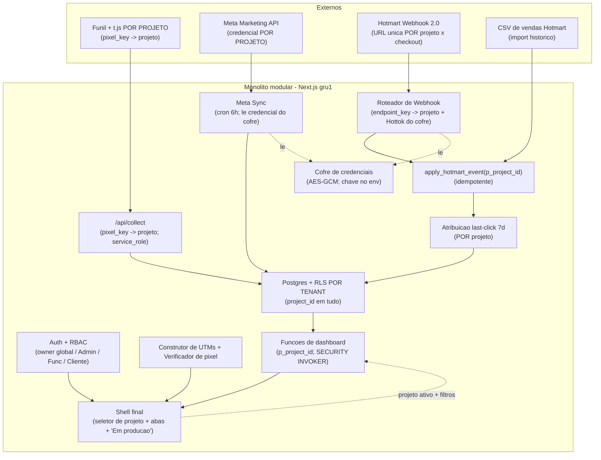

# Arquitetura V3 — Sistema de Rastreamento por UTM

> Documento de arquitetura **fechado e executável**, escrito para o **Claude Code** implementar em cima do repositório existente (`rastreamento-utm`).
> Leia também, no repo: `CLAUDE.md` (regras de ouro), `PROGRESSO.md` (estado da v1+v2), `arquitetura-rastreamento-utm-v1.md` (base), `arquitetura-rastreamento-utm-v2.md` (vigente) e `mapa-funcional-rastreamento-utm.md` (o NORTE / estado-final). **Em conflito, este documento manda para a v3.**
> Princípio central: a v3 **estende** a v1+v2 (mesma stack, mesmo monólito modular, mesmo Postgres). **Migrations aditivas a partir de `0022`, nada de reescrever do zero, NUNCA quebrar dados reais em produção.**
> O que muda de natureza na v3: deixa de ser single-tenant. Esta é a **FUNDAÇÃO multi-cliente** do mapa — o esqueleto que precisa funcionar mesmo com 1 usuário, validado em **1 usuário × 1 projeto × 1 funil (Perpétuo)**.

---

## 1. Contexto e postura

- **A v3 é a fundação geral da ferramenta interna multi-cliente.** Hierarquia `Usuário → Projetos → Funis`; papéis **Admin / Funcionário / Cliente por projeto**; **owner global** (o dono da agência). NÃO é SaaS à venda — "cliente/projeto" é só **unidade de isolamento interno**.
- **Foco desta leva (recorte travado):** fundação multi-tenant + **re-acomodar tudo que já existe como o "Projeto Padrão"** (cliente atual, funil *Geografia da Voz*, tipo Perpétuo). Itens P0/Base do mapa: USR-01..05, PRJ-01..04, INT-02/03/04/05/06/08 (Hotmart), RAS-01/02/07, ENG-04/05, FUN-00/01. **+ INT-07 (CSV de vendas Hotmart)** e **+ Construtor de UTMs com verificador de pixel** (pedidos explícitos do dono).
- **A "cara final" agora.** A v3 entrega o **shell completo da plataforma** (abas laterais, navegação inteira, todos os menus mapeados no lugar). O que ainda não foi desenvolvido aparece com um **gate "Em produção"** (placeholder de "em construção"). O Perpétuo é construído mas marcado **não-finalizado 100%** — o refino fino de todos os funis fica para o fim da fundação.
- **Padrão-ouro de segurança e isolamento, por decisão do dono.** Isolamento por tenant **reforçado no banco (RLS por filiação)**, não só na aplicação. Credenciais por projeto **cifradas com chave fora do banco**. Sem abrir mão de performance.
- **Só Hotmart na v3** (Eduzz/Kiwify ficam para levas seguintes), mas com a normalização (INT-06) e o roteamento (INT-05) **já abstraídos** para receber novos checkouts sem migração estrutural.
- **Fora da v3 (V4+):** Leads/Jornada/CRM (RAS-03/04/05/06), engines de Pesquisa/Qualificação/Pipeline (ENG-01/02/03), demais tipos de funil (FUN-02..06), OAuth 1-clique (INT-01 — depende de app review), CSV de **gasto de anúncio** histórico, e o módulo "Meu Negócio" (custo/lucro consolidado).
- Stack mantida: **Next.js (App Router) + Supabase (Postgres/Auth/Edge/Cron) + Vercel (gru1)**. Monólito modular, **um Postgres, isolamento lógico/pool por tenant — não físico** (Ref.: Principal §9.7 — 1 quantum; §8.4 Z-axis lookup split; §11 swim lanes / fault isolation por customer).

> **Suposições que confirmo na revisão de fase (corrija se quiser):** (a) **criar projeto e criar usuário** são ações do **owner** na v3 (Admin de projeto gerencia um projeto existente, inclusive membros, mas a criação inicial é do owner — liberar isso para Admin é um flag trivial depois); (b) o **verificador de pixel** detecta o snippet no **HTML servido** da página (se um gerenciador de tags injeta em runtime, pode não aparecer → retorna "não detectado, verifique manualmente"); (c) o **CSV da v3** importa **vendas/conversões da Hotmart** (não gasto de anúncio), deduplicando por `transaction`.

---

## 2. Capacidade (back-of-envelope) — confirma "sem nova infra", mesmo multi-tenant

Volume real medido (v1/v2): centenas de eventos, ~769 insights/15 dias, ~437 orders, 137 clientes únicos — o banco está em **dezenas de MB**. A ferramenta é **interna de agência**: a ordem de grandeza de tenants é **unidades a poucas dezenas de projetos**, não milhares. Mesmo com N projetos × histórico de 3–4 meses, projeta-se **baixas centenas de MB** → cabe folgado no **plano gratuito do Supabase**. (Ref.: System Design §2.)

**Implicações:**
- **Nada de sharding/pods físicos/NoSQL/fila/microservices.** Multi-tenancy é **lógica** (coluna `project_id` + RLS), não física. (Ref.: Principal §8.4 — Z-axis dá isolamento de falha por customer **sem** exigir banco por tenant neste volume.)
- **RLS não derruba a performance neste volume.** O custo de uma política `using (app_can_access(project_id))` com função `STABLE` e índice em `project_id` é desprezível para datasets desta ordem. O dashboard continua lendo de **funções/rollups** (rápido), nunca do Meta ao vivo (Ref.: Principal §19 caching; §34.4 performance tactics).
- **Credenciais cifradas não pesam no caminho quente.** Segredos são lidos só na **sync (cron 6h / on-demand)** e no **webhook (por venda)** — **nunca** num carregamento de dashboard. Decifrar um token de ~200 bytes (AES-GCM) custa microssegundos. Logo: "mais seguro **e** rápido" ao mesmo tempo (resposta à exigência do dono).

---

## 3. Decisões arquiteturais (ADRs v3)

Formato: Contexto → Decisão → Trade-off → Ref. (padrão Nygard — Principal §25.3.)

**ADR-v3-1 — Tenant = `project_id`, isolamento lógico (Z-axis), não físico.**
- *Contexto:* o mapa exige que dados de um projeto nunca vazem para outro; o volume é interno/baixo.
- *Decisão:* adicionar `project_id` (FK → `projects`) em **todas as 14 tabelas de dados** e isolar por **RLS por projeto** num **único Postgres**. Sem banco/schema por tenant.
- *Trade-off:* simples, barato, operacionalmente leve; isolamento de falha por tenant é **parcial** (compartilham o mesmo banco) — aceitável neste volume. (−) exige disciplina: toda query nova precisa carregar `project_id`. (Ref.: Principal §8.4, §11.2 "se dois swim lanes compartilham um banco, são o mesmo swim lane" — assumido conscientemente; isolamento aqui é de **dados**, não de **falha física**.)

**ADR-v3-2 — Migrations estritamente aditivas a partir de `0022`; `project_id` nasce NULLABLE e vira NOT NULL só após backfill.**
- *Decisão:* `ADD COLUMN project_id bigint` (nullable) → **backfill** para o Projeto Padrão → só então `SET NOT NULL` + `DEFAULT`. `CREATE TABLE IF NOT EXISTS`; nada de `DROP`/`ALTER` destrutivo em dado real.
- *Trade-off:* zero downtime e zero risco de violar linha existente; (−) janela curta em que a coluna aceita NULL (mitigada por backfill imediato na mesma leva). (Ref.: Database Internals §12 — evolução de schema com compatibilidade; adicionar campo opcional é backward/forward-compatible.)

**ADR-v3-3 — `visitor_id` permanece PK global (não vira chave composta).**
- *Contexto:* tornar `(project_id, visitor_id)` a PK quebraria as FKs de `touchpoints`/`tracking_events`/`orders` → **não-aditivo**.
- *Decisão:* manter `visitor_id` como PK global (24-hex aleatório, CHECK regex da v1). `project_id` entra como coluna + índice; o `visitor_id` pertence a um projeto via o pixel que o gerou.
- *Trade-off:* mantém compatibilidade total e a regra de ouro do `visitor_id`; (−) colisão teórica de `visitor_id` entre projetos — **desprezível** (96 bits aleatórios, pixel por projeto). Documentado em §14.

**ADR-v3-4 — Isolamento em DEFESA EM PROFUNDIDADE: leitura via sessão do usuário + RLS; ingestão via `service_role`.**
- *Contexto:* hoje **tudo** lê via `service_role` (ignora RLS) atrás do login — não há autorização por linha. O dono pediu padrão-ouro ("impossível vazar", critério PRJ-03).
- *Decisão:* dois caminhos distintos:
  - **Leitura (dashboards/telas):** passa a usar o **cliente de sessão do usuário** chamando funções `SECURITY INVOKER`; **políticas RLS por filiação** (par usuário↔projeto) garantem, no próprio Postgres, que é **impossível** retornar linha de projeto não-autorizado — mesmo com bug de aplicação ou `project_id` forjado.
  - **Ingestão (`/collect`, webhook, sync Meta, cron de poda):** continua via `service_role` (sistemas externos, sem sessão de usuário) — `service_role` **bypassa RLS** por design. A integridade do "projeto certo" vem do **roteamento** (chave do pixel → projeto; chave do endpoint → projeto), não da RLS.
- *Trade-off:* isolamento garantido pelo banco (camada que não depende do código de aplicação estar perfeito) + ingestão sem fricção; (−) troca o read path de `admin`→sessão-do-usuário e exige a função-helper de filiação. (Ref.: Principal §34.6 Resist — *authorize users / RBAC*, *least privilege*, *limit access*.)

**ADR-v3-5 — Autorização centralizada em helper `app_can_access(project_id)` + `app_role_in(project_id)`.**
- *Decisão:* funções `STABLE SECURITY DEFINER` (`search_path=public`) que resolvem, a partir de `auth.uid()`: se é **owner** (vê tudo) ou **membro** do projeto (e com qual papel). Toda política RLS de leitura usa `using (app_can_access(project_id))`; ações sensíveis no servidor checam `app_role_in(...) = 'admin'`.
- *Trade-off:* uma fonte única de verdade para autorização (fácil auditar, difícil divergir); planner reusa o resultado `STABLE` por statement (performático); (−) `SECURITY DEFINER` exige cuidado de `search_path` (já é padrão do projeto desde a 0014).

**ADR-v3-6 — Owner global + RBAC por projeto (Admin/Funcionário/Cliente), reforço no BACKEND.**
- *Decisão:* `app_users.is_owner` (o dono — você) = visão e gestão de **todos** os projetos/usuários/funis. Papel por **par usuário↔projeto** (`project_members.role`): **Admin** = poder total no projeto (todas as ações sensíveis + add/remove membros); **Funcionário** = configs não-sensíveis (criar/editar funil, configurar fontes/integrações, importar CSV) mas **bloqueado** em deletar dados, desvincular contas, excluir funil, editar custos, gerenciar membros; **Cliente** = só visualiza dashboards do projeto. Reforço em **Server Actions/RPC**, não só ocultando botões.
- *Trade-off:* casa exatamente com a matriz do mapa; backend-enforced = seguro; (−) cada ação sensível precisa de uma checagem explícita de papel (centralizada no helper). (Ref.: Principal §34.6 — *authorize (RBAC)*.)

**ADR-v3-7 — Cofre de credenciais por projeto: coluna cifrada (AES-256-GCM) com chave-mestra FORA do banco.**
- *Contexto:* hoje token Meta + Hottok são `.env` únicos da Vercel. Padrão-ouro pedido, sem lentidão.
- *Decisão:* tabela `project_credentials` guardando **só ciphertext + IV + auth tag**. Cifra/decifra no **Node** (`node:crypto`) com `CREDENTIALS_MASTER_KEY` (32 bytes) vivendo **no env da Vercel** (server-only), **nunca no banco**. Coluna `key_version` para rotação futura. Leitura só na sync/webhook (fora do caminho quente).
- *Trade-off:* **vazar o banco ≠ vazar segredo** (a chave não está no banco); rápido (decifra fora do dashboard); (−) gestão de 1 segredo a mais + procedimento de rotação. (Ref.: Principal §34.6 — *maintain data confidentiality (encryption)*.)
- **⚠️ Atualização operacional (revisão de execução V3) — ADR-v3-7a:** a chave-mestra passou a viver no **Supabase Vault** (`vault.create_secret`, nome `credentials_master_key`), **não** no env da Vercel. *Motivo:* a política de egresso do ambiente de execução bloqueia a API da Vercel e a integração disponível não cria *environment variables* — o dono não opera o painel da Vercel; o Supabase, sim, é 100% gerenciável pela IA. *Por que continua seguro:* o Vault cifra os segredos com uma **chave-raiz gerenciada pela infra do Supabase, fora das tabelas SQL** — um `pg_dump` **não** revela o segredo, então a propriedade "vazar o banco ≠ vazar o segredo" se mantém. Para decifrar uma credencial de projeto ainda é preciso **service_role** (que vive no env da Vercel) **+** acesso ao banco. *Trade-off vs. original:* a chave-raiz fica no mesmo fornecedor (Supabase) em vez de um sistema separado (Vercel) — separação um pouco menor, segurança ainda forte. `lib/crypto` lê a chave do Vault (server-only, `service_role`), com *fallback* para `process.env.CREDENTIALS_MASTER_KEY` caso um dia seja adicionada na Vercel. *Rotação:* `key_version` no `project_credentials` + novo secret no Vault.

**ADR-v3-8 — Roteamento de webhook por (projeto × checkout) via chave de endpoint pública-inadivinhável.**
- *Decisão:* URL única por projeto: `POST /api/webhook/hotmart/{endpoint_key}`. `endpoint_key` é um token aleatório (não-segredo, mas não-enumerável) em `project_endpoints`, mapeado ao `project_id`. Valida o **Hottok do projeto** (lido do cofre, não do env). Idempotência por `transaction` (unique global) mantida. Stampa `project_id` no `apply_hotmart_event`.
- *Trade-off:* cada cliente cola **sua** URL; isolamento por construção; (−) há um passo manual de configuração por cliente (desejado — tem tela de passo a passo). **Backward-compat:** a rota legada `/api/webhook/hotmart` continua válida e roteia para o **Projeto Padrão** (lendo o Hottok já migrado para o cofre), para **não quebrar** a integração Hotmart ao vivo. (Ref.: Principal §34.6 — *verify message integrity* (Hottok timing-safe).)

**ADR-v3-9 — Pixel (t.js) por projeto, com retrocompatibilidade do funil ao vivo.**
- *Decisão:* `t.js` passa a ser servido **com a chave do projeto embutida** (rota que injeta `pixel_key` como constante: `GET /p/{pixel_key}/t.js`); o `/collect` resolve o `project_id` pela `pixel_key` enviada. **Backward-compat:** o `t.js` "pelado" (sem chave), que já está instalado no funil *Geografia da Voz*, resolve para o **Projeto Padrão** — o funil ao vivo **continua rastreando sem mudança**.
- *Trade-off:* robusto contra construtores de página que removem atributos (chave embutida no arquivo servido, não em `data-*`); (−) servir o script por rota (não estático puro) — custo trivial, com cache. Mantém o `visitor_id` 24-hex, DNT/LGPD e a injeção de `src`. (Ref.: System Design §3 — edge/CDN.)

**ADR-v3-10 — Funil = "lente"/escopo sobre as fontes do projeto; 1 Perpétuo por projeto na v3 (ENG-05 reposicionado).**
- *Decisão:* o que hoje é config **global** (produtos `included` + tags de campanha em `tracking_config`) migra para o **nível do funil** como os "filtros de fonte" (ENG-05): **campanha** = todas ou contém-palavra; **produto** = todas ou oferta específica; **recorrência** = só 1ª compra ou todas. A v3 **não** permite múltiplos funis por projeto ainda — isso entra quando houver um 2º tipo (V4). O funil `funnels` (tabela já existente) ganha `project_id` + `type` + config de filtros.
- *Trade-off:* menos UI nova, valida o 1×1×1 do mapa, reaproveita a tabela `funnels` e o `tracking_events.funnel_id` (hoje null); (−) a config sai de "single-row global" para "por funil" (migração tratada no backfill).

**ADR-v3-11 — Funções de dashboard recebem `project_id` e viram `SECURITY INVOKER`.**
- *Decisão:* `central_summary`, `central_timeseries`, `origem_overview`, `customers_list`, `customer_history`, `campaigns_table`, `creatives_consolidated` ganham `p_project_id` como **1º parâmetro**, filtram todas as tabelas por ele, leem a config (produtos/tags/tz) **do projeto**, e passam a `SECURITY INVOKER` com `grant execute` a `authenticated` (para a sessão do usuário chamá-las sob RLS).
- *Trade-off:* dois reforços (app passa o projeto ativo + RLS garante a autorização); números preservados para o Projeto Padrão; (−) trocar assinatura de função = nova versão (a antiga, de 2 args, revogada de anon/auth, é substituída e os callers atualizados em lockstep — é mudança de **schema/função**, não de **dado**, logo permitida pela regra de ouro).

**ADR-v3-12 — Importação de vendas via CSV (Hotmart) com dedup por `transaction`.**
- *Decisão:* assistente de mapeamento de colunas → modelo único de `orders`; **dedup por `transaction`** (não duplica vendas já recebidas por webhook); stampa o `project_id` ativo; aplica as mesmas regras de líquido/coorte/atribuição. Histórico de importações em `import_batches`.
- *Trade-off:* preenche o histórico que o webhook não tem (rastreio era parcial); (−) linha sem `visitor_id` entra como **"não rastreada"** (sem atribuição) — consistente com `origem_overview`. CSV de **gasto de anúncio** fica para depois.

**ADR-v3-13 — Construtor de UTMs + verificador de pixel como ferramentas do projeto.**
- *Decisão:* ferramenta que recebe a URL de vendas do usuário e **gera links rastreados** (defaults **pago/Meta** e **orgânico** já prontos — esquema canônico de `docs/instalacao-rastreio.md`; usuário adiciona variações). **Salva tabelas de links nomeadas** (reabríveis) em `utm_link_sets`. **Verificador:** Server Action que faz **fetch server-side** da página e procura o snippet do pixel no HTML.
- *Trade-off:* tira o trabalho manual de montar UTMs e confere a instalação; (−) o fetch de URL arbitrária exige **guarda anti-SSRF** (ver §14) e o verificador não enxerga injeção em runtime (aviso de limitação). (Ref.: Principal §34.6 — *limit exposure / minimize attack surface*.)

**ADR-v3-14 — Shell final agora, com gate "Em produção" no não-construído.**
- *Decisão:* construir o layout final (abas laterais) com **toda** a navegação do mapa presente. Áreas não desenvolvidas (Leads/Jornada/CRM, FUN-02..06, OAuth, Meu Negócio) exibem um placeholder **"Em produção"**. O Perpétuo é construído mas sinalizado **não-100%**.
- *Trade-off:* o dono já enxerga "onde tudo vai morar" e o produto parece completo; (−) placeholders que precisam ser substituídos depois (rastreados como dívida explícita).

---

## 4. Visão de arquitetura (componentes)

Reaproveita a topologia da v1/v2. **Novo/ampliado na v3 em destaque.**



**Módulos do código (mantém a separação por domínio, + novos):** `lib/tracking`, `lib/meta`, `lib/sales`, `lib/attribution`, `lib/supabase`, **`lib/auth` (RBAC/helpers), `lib/tenant` (projeto ativo), `lib/crypto` (cofre), `lib/utm` (construtor), `lib/import` (CSV)**, `app/(dashboard)` (telas), `app/api/*`.

---

## 5. Modelo de dados (alvo + migrations a partir de `0022`)

**Regras de migration (v3):** o Claude Code **lê primeiro** as migrations existentes (`0001`→`0021`) e o schema real; escreve **novas a partir de `0022`**, **aditivas**; **RLS ligado** em toda tabela nova; **`search_path` fixo** nas funções novas; **`project_id` nasce NULLABLE → backfill → NOT NULL**. **Nunca** apagar/reescrever dado real (há vendas reais).

### 5.1 Tabelas novas

| Tabela | Colunas-chave | Papel |
|---|---|---|
| `projects` | `id` (PK), `name`, `niche_tag`, `timezone` (default `America/Sao_Paulo`), `currency` (default `BRL`), `status` (`active`/`archived`), `created_at` | O "cliente"; fronteira de isolamento (PRJ-01/02) |
| `app_users` | `id` (uuid, = `auth.users.id`), `full_name`, `is_owner` (bool, default false), `status`, `created_at` | Perfil do usuário; owner global (USR-03) |
| `project_members` | `id`, `project_id` (FK), `user_id` (FK→`app_users`), `role` (enum `admin`/`funcionario`/`cliente`), `created_at`, **unique(project_id,user_id)** | Atribuição usuário↔projeto + papel (USR-04/PRJ-04) |
| `project_credentials` | `id`, `project_id` (FK), `provider` (`meta`/`hotmart`), `kind` (`token`/`hottok`/`account_id`), `ciphertext` (bytea), `iv` (bytea), `auth_tag` (bytea), `key_version` (int), `updated_at`, **unique(project_id,provider,kind)** | Cofre por tenant (INT-04) |
| `project_endpoints` | `id`, `project_id` (FK), `provider` (`hotmart`), `endpoint_key` (text, **unique**), `active` (bool), `created_at` | Roteamento de webhook (INT-05) |
| `project_pixels` | `id`, `project_id` (FK), `pixel_key` (text, **unique**), `active` (bool), `created_at` | Pixel por projeto (RAS-01/02) |
| `utm_link_sets` | `id`, `project_id` (FK), `name`, `base_url`, `links` (jsonb: `[{label,kind,params,full_url}]`), `created_at`, `updated_at` | Tabelas de links salvas e nomeadas (Construtor de UTMs) |
| `import_batches` | `id`, `project_id` (FK), `kind` (`sales`), `filename`, `row_count`, `created_by` (uuid), `created_at` | Histórico de importações CSV (INT-07) |

> **Sobre config do funil:** os campos hoje em `tracking_config` (campanha-tags, retenção) e `products.included` passam a ser **escopados por funil/projeto** (ADR-v3-10). Implementação aditiva: `funnels` ganha `project_id` + `type` (`perpetuo`/…) + `source_filters` (jsonb: campanhas/produto/recorrência); `tracking_config` e `products` ganham `project_id` (backfill abaixo). A consolidação fina "global × projeto × funil" é o Domínio 7 do mapa (leva futura).

### 5.2 Colunas a adicionar nas tabelas existentes

| Tabela | Adicionar |
|---|---|
| `funnels` | `project_id` (FK, NULLABLE→NOT NULL), `type` (text), `source_filters` (jsonb) |
| `ad_accounts` | `project_id` (FK) — (já tem `token_ref`; o segredo real vai para o cofre) |
| `campaigns` / `adsets` / `ads` | `project_id` (FK) |
| `visitors` | `project_id` (FK) |
| `touchpoints` | `project_id` (FK) |
| `tracking_events` | `project_id` (FK) |
| `orders` | `project_id` (FK) |
| `order_events` | `project_id` (FK) |
| `attributions` | `project_id` (FK) |
| `meta_insights_daily` | `project_id` (FK) |
| `products` | `project_id` (FK) — mantém `product_id` como identificador (Hotmart é globalmente único por produto; ADR-v3-3 análogo) |
| `tracking_config` | `project_id` (FK) — deixa de ser linha única `id=1` e passa a 1 linha por projeto |

Índice em `project_id` em **todas** as tabelas acima (e nos joins quentes). Após o backfill: `SET NOT NULL` + `DEFAULT` (onde fizer sentido) nas colunas `project_id`.

### 5.3 PLANO DE BACKFILL — Projeto Padrão (o item de MAIOR risco)

> Objetivo: **todo o dado atual** passa a pertencer ao Projeto Padrão **sem alterar nenhum valor real**. `project_id` é a **única** coluna escrita; nenhum `gross/net/refunded/transaction/order_date` é tocado.

**Ordem (migration `0024`, transacional):**
1. Garantir o Projeto Padrão criado em `0022`: `INSERT INTO projects (name,...) VALUES ('Geografia da Voz', ...)` → capturar `:default_id`.
2. Para **cada** tabela de dados: `UPDATE <tabela> SET project_id = :default_id WHERE project_id IS NULL;` (ordem livre — é set de coluna, não insert de FK).
3. `tracking_config`: a linha `id=1` recebe `project_id = :default_id`. Criar `funnels` "Perpétuo — Geografia da Voz" (`type='perpetuo'`, `project_id=:default_id`) e migrar para o seu `source_filters` os `campaign_name_tags` + os `products.included` atuais (a "lente" de hoje vira a config do funil).
4. `products`: `UPDATE products SET project_id = :default_id;`.
5. **Conferência de contagem (gate):** cada tabela deve ter `count(project_id IS NULL) = 0` e `count(*)` idêntico ao pré-migração. Bater os marcos conhecidos do `PROGRESSO.md` (ex.: 351 `tracking_events`, 294 `touchpoints`, 437 `orders`).
6. Só então (migration `0024b` ou final de `0024`): `ALTER TABLE ... ALTER COLUMN project_id SET NOT NULL` + `SET DEFAULT :default_id` onde aplicável.

**Conferência dos NÚMEROS DE OURO (gate de regressão):** após o backfill, rodar as funções de dashboard para o Projeto Padrão e confirmar **byte-a-byte** com o pré-migração:
- `net_revenue` = **R$ 6.587,23** (principal 5.508,12 + order_bump 1.079,11);
- investido com a tag `[GEO-VOZ-02]` = **R$ 12.900**;
- rastreadas (7) + não rastreadas (120) = 127; 151 compras → 137 clientes únicos.
Qualquer divergência **bloqueia** a fase.

### 5.4 Funções (RPC) — mudanças

- **Escrita:** `apply_hotmart_event(... , p_project_id)` (stampa `orders.project_id` e propaga a `order_events`); `attribute_order(p_order_id)` passa a filtrar touchpoints **pelo `project_id` do pedido** (defesa; já implícito porque o `visitor_id` é de um projeto); `recompute_order_totals` inalterado; `prune_raw_events()` passa a podar **por projeto** respeitando `tracking_config.retention_days` de cada um.
- **Leitura:** todas as funções de §5.1 da v2 ganham `p_project_id` (1º arg), filtram por ele, leem produtos/tags/tz **do projeto**, viram `SECURITY INVOKER`, `grant execute` a `authenticated`. Mantêm líquido + coorte + fuso do **projeto** (default = SP).
- **Helpers de autorização:** `app_can_access(p_project_id bigint) returns boolean` e `app_role_in(p_project_id bigint) returns text` — `STABLE SECURITY DEFINER`, `search_path=public`.

---

## 6. Multi-tenancy & RLS (detalhe — padrão-ouro)

### 6.1 Modelo de autorização (fonte única)

```sql
-- owner enxerga tudo; demais, só projetos onde são membros.
create or replace function app_can_access(p_project_id bigint)
returns boolean language sql stable security definer set search_path = public as $$
  select exists (select 1 from app_users u where u.id = auth.uid() and u.is_owner)
      or exists (select 1 from project_members m
                 where m.user_id = auth.uid() and m.project_id = p_project_id);
$$;

create or replace function app_role_in(p_project_id bigint)
returns text language sql stable security definer set search_path = public as $$
  select case
    when exists (select 1 from app_users u where u.id = auth.uid() and u.is_owner) then 'owner'
    else (select role from project_members
          where user_id = auth.uid() and project_id = p_project_id)
  end;
$$;
```

### 6.2 Políticas por tabela

- **Tabelas de DADOS** (`visitors`, `touchpoints`, `tracking_events`, `orders`, `order_events`, `attributions`, `campaigns`, `adsets`, `ads`, `ad_accounts`, `meta_insights_daily`, `funnels`, `products`, `tracking_config`): política de **SELECT** para `authenticated`:
  ```sql
  create policy tenant_read on <tabela> for select to authenticated
    using (app_can_access(project_id));
  ```
  **Escrita** nas tabelas de dados **não** é feita por `authenticated` (vem por `service_role` na ingestão ou via RPC) → sem política de write para `authenticated`.
- **Tabelas de CONFIG** (`projects`, `project_members`, `tracking_config`, `products`, `funnels`, `utm_link_sets`, `project_endpoints`, `project_pixels`, `project_credentials`): leitura por membros; **escrita gated por papel**:
  - `projects` criar/arquivar → **owner**; editar config não-sensível → **admin/funcionario** do projeto.
  - `project_members` add/remove → **admin** (ou owner).
  - `project_credentials` → **admin** (ou owner) escreve; leitura **nunca** por `authenticated` (só `service_role` na sync/webhook) — política **deny** para `authenticated` em `project_credentials` (segredo não chega ao browser nem decifrado nem cifrado).
  - `utm_link_sets`, filtros de funil, pixel, retenção → **admin/funcionario**.
- **`anon`:** sem política em nada → **sem acesso** (negativa por padrão, como na v1/v2).
- **`service_role`:** **bypassa RLS** por design (mantém `/collect`, webhook, sync, cron, e operações de backfill funcionando).

### 6.3 Caminhos (quem usa qual cliente)

| Caminho | Cliente | RLS? | Como acha o projeto |
|---|---|---|---|
| Dashboards / telas (leitura) | sessão do usuário (anon key + cookie) | **SIM** (membership) | `project_id` ativo passado pela app; RLS confirma autorização |
| `/api/collect` (ingestão) | `service_role` | bypass | `pixel_key` no corpo → `project_pixels` → `project_id` |
| Webhook Hotmart | `service_role` | bypass | `endpoint_key` na URL → `project_endpoints` → `project_id` |
| Sync Meta (cron/on-demand) | `service_role` | bypass | itera projetos com credencial; lê o cofre por projeto |
| Poda (cron) | `service_role` | bypass | itera projetos; `retention_days` por projeto |
| Ações de config (escrita) | sessão do usuário | **SIM** + checagem de papel no servidor | `project_id` ativo + `app_role_in` |

### 6.4 Performance da RLS

Índice em `project_id` + helper `STABLE` (avaliado uma vez por statement). Neste volume (dezenas–baixas centenas de MB), o overhead é desprezível. Dashboards continuam batendo em **funções/rollups** (Ref.: Principal §34.4 *manage resources*; §19 caching). Credenciais ficam **fora** do caminho de leitura (ADR-v3-7).

### 6.5 Validação do isolamento com 2 projetos populados (SEM tocar no dado real)

> Tática de **Sandbox** (Principal §34.7) — testar isolamento sem afetar produção.

1. Criar um **2º projeto sintético** "Projeto Teste" e popular com dados **claramente falsos** (transactions `TESTE-*`, e-mails `@exemplo.test`, visitors sintéticos, insights fictícios). Nunca tocar nas tabelas do Projeto Padrão real.
2. **Matriz de teste:**
   - Usuário membro **só** do Projeto Teste → consultas retornam **apenas** linhas `TESTE-*`; **zero** linhas reais.
   - Usuário membro **só** do Projeto Padrão → **não** vê nenhuma linha `TESTE-*`.
   - **Owner** (você) → vê **ambos**.
   - Forjar `p_project_id` de um projeto não-autorizado na chamada → RLS retorna **zero linhas** (autorização não depende do arg).
   - Webhook na URL do Projeto Teste → grava com `project_id` do Teste; na URL legada → grava no Padrão.
3. **Regressão dos números de ouro** (§5.3) no Projeto Padrão = idênticos ao pré-migração.
4. **Limpeza:** excluir **apenas** o projeto sintético e seus dados (é dado falso — exclusão permitida). Dado real **jamais** é tocado.

---

## 7. Cofre de credenciais por projeto (INT-04)

- **Esquema:** `project_credentials(project_id, provider, kind, ciphertext, iv, auth_tag, key_version)`.
- **Cripto:** AES-256-GCM no Node (`lib/crypto`); chave `CREDENTIALS_MASTER_KEY` (32 bytes base64) no **env da Vercel** (server-only, nunca commitada, nunca no banco). `iv` aleatório por segredo; `auth_tag` valida integridade na decifragem.
- **Acesso:** só `lib/meta/sync` (Meta token + account_id) e o roteador de webhook (Hottok) decifram — **server-only**, **fora** do caminho de dashboard. `authenticated` tem política **deny** em `project_credentials` (o segredo não chega ao browser de forma alguma).
- **Migração do Projeto Padrão:** cifrar o **token Meta** e o **Hottok** de hoje (que estão no env) para o cofre do Projeto Padrão. Manter o env como fallback **só durante a transição** da fase de ingestão; remover depois.
- **Rotação:** `key_version` permite re-cifrar-na-leitura no futuro (não implementado na v3; só preparado). (Ref.: Principal §34.6 — *maintain data confidentiality*; *limit exposure*.)

---

## 8. Roteamento de webhook por projeto (INT-05)

- **URL por projeto:** `POST /api/webhook/hotmart/{endpoint_key}`. `endpoint_key` (de `project_endpoints`) → `project_id`. **Não-enumerável** (aleatório), mas não é o segredo — o segredo é o **Hottok** (validado timing-safe contra o valor do cofre do projeto).
- **Fluxo:** resolver projeto pela `endpoint_key` → carregar Hottok do cofre → validar (timing-safe) → `parseHotmartPayload` → `apply_hotmart_event(..., p_project_id)` (idempotente por `transaction`) → enriquecimento best-effort (comprador/produto), tudo **escopado ao projeto**.
- **Rejeições:** `endpoint_key` inexistente/inativo → 404 logado; Hottok inválido → 401 logado; payload sem `transaction` → 200 + log (re-tentar não ajuda). Nunca logar PII.
- **Backward-compat:** rota legada `/api/webhook/hotmart` (sem chave) → **Projeto Padrão** (Hottok do cofre do Padrão). A Hotmart do cliente atual **não precisa ser reapontada** para a v3 entrar no ar; reapontar para a URL com chave é um passo manual opcional depois.
- A tela de integração (passo a passo) mostra a **URL para copiar**, o **campo do Hottok** e o **status** (recebendo/sem sinal). (Ref.: Principal §34.6 — *verify message integrity*.)

---

## 9. Mudanças por componente

### 9.1 Rastreio — `public/t.js` + `app/api/collect`
- `t.js`: servido por rota `GET /p/{pixel_key}/t.js` com a `pixel_key` **embutida** como constante; envia `pixel_key` no corpo do `/collect`. Mantém visitor_id 24-hex, UTM/`fbclid`, sinais (device/UA/`fbp`/`fbc`), injeção de `src`, DNT. O `t.js` "pelado" segue válido → Projeto Padrão.
- `/collect`: resolve `project_id` pela `pixel_key` (ou Padrão se ausente); stampa `project_id` em `visitors`/`touchpoints`/`tracking_events`. Mantém `service_role`, rate limit, allow-list, geo/IP server-side.

### 9.2 Webhook — `app/api/webhook/hotmart/[endpoint_key]` + `lib/sales`
- Roteia por `endpoint_key`, valida Hottok **do cofre**, `apply_hotmart_event(..., p_project_id)`. Rota legada → Padrão (§8). Idempotência + líquido + restatement por coorte inalterados.

### 9.3 Atribuição — `lib/attribution`
- Last-click 7d **por projeto** + snapshot da origem + herança no reembolso (v1/v2). `attribute_order` filtra touchpoints pelo `project_id` do pedido (defesa).

### 9.4 Sync do Meta — `lib/meta`
- Itera **projetos com credencial Meta**; para cada um, **decifra o token do cofre**, puxa insights (vídeo + `link_clicks` + `effective_status`, como na v2) e faz upsert escopado com `project_id`. Lock/retry/backoff/paginação reaproveitados. Cron 6h itera todos os projetos ativos.

### 9.5 Camada de dados do dashboard
- Funções com `p_project_id` + `SECURITY INVOKER` + grant `authenticated` (§5.4). Telas leem via **sessão do usuário** passando o **projeto ativo** (`lib/tenant`). Funil por dimensão de UTM (v2) inalterado, agora escopado.

### 9.6 Auth & RBAC — `lib/auth`
- Helpers `requireUser()`, `requireRole(projectId, roles[])`, `isOwner()`. **Toda** Server Action sensível chama `requireRole` (backend-enforced). Seletor de projeto persiste o `project_id` ativo (cookie/estado), validado contra a filiação a cada request.

### 9.7 Retenção/poda — `prune_raw_events()` por projeto
- Poda `tracking_events`/`touchpoints` por `retention_days` **de cada projeto**; nunca toca `orders`/agregados/`visitors` (regra da v2). Cron diário.

### 9.8 Construtor de UTMs — `lib/utm` + `app/(dashboard)/.../configurar/utm`
- Recebe URL base; gera links **pago** (`utm_source=meta&utm_medium=paid_social&utm_campaign=…&utm_content={{ad.id}}&utm_term={{adset.id}}`) e **orgânico** (presets bio/perfil/direto) prontos; usuário adiciona/edita variações; salva como `utm_link_sets` **nomeada**; reabre/edita/duplica.

### 9.9 Verificador de pixel — Server Action `pixel-check`
- Fetch **server-side** da URL informada; procura o snippet do pixel no HTML (chave do projeto / `/t.js`). **Guarda anti-SSRF** (§14). Retorna `{found, detail}`; avisa que injeção em runtime pode não ser detectada.

### 9.10 Importador CSV — `lib/import` + `app/(dashboard)/.../configurar/importar`
- Assistente de mapeamento de colunas → `orders` (modelo único); **dedup por `transaction`**; stampa `project_id`; aplica líquido/coorte/atribuição; grava `import_batches`. Linha sem `visitor_id` → não rastreada.

---

## 10. Definições de métrica (herdadas + nota da v3)

As definições canônicas da **v2 §7** seguem **inalteradas** (Investido, Faturamento líquido, Lucro, ROAS, CAC, ticket, taxa de reembolso, connect rate, ida ao checkout, conversões, hook rate, retenção, CTRs, CPM/CPC). Mudanças da v3:
- Todas passam a ser computadas **por projeto** (e, dentro do projeto, pela "lente" do funil — ENG-05).
- **Faturamento e nº de vendas continuam SEMPRE do webhook (líquido), nunca do anúncio** — agora incluindo as vendas **importadas por CSV** (mesmo modelo, dedup por `transaction`).
- O **fuso** das janelas/coortes passa a ser o `timezone` **do projeto** (default `America/Sao_Paulo`).

---

## 11. Arquitetura de informação / Navegação (a "cara final")

Shell com **abas laterais** + **seletor de projeto global** no topo. Legenda: ✅ construído na v3 · 🚧 "Em produção" (placeholder).

```
[Topo: Seletor de Projeto ▾ | Filtro de data | Atualizar | Sair]
└─ (se OWNER) Administração global ✅  — projetos, usuários, papéis (visão de tudo)

PROJETO ATIVO
├─ Central (dashboard) ✅            — reescopada por projeto
├─ Origem das UTMs ✅                — reescopada por projeto
├─ Campanhas (gerenciador) ✅        — reescopada por projeto
├─ Funis
│   ├─ Perpétuo ✅ (marcado "não finalizado 100%")
│   ├─ High Ticket 🚧
│   ├─ Assinaturas 🚧
│   ├─ Lançamento 🚧
│   ├─ Negócios físicos 🚧
│   └─ Venda de serviço 🚧
├─ Leads & Jornada 🚧               — (RAS-03/04/05/06, V4+)
├─ Pesquisa / Pipeline (CRM) 🚧     — (ENG-01/02/03, V4+)
└─ Configurar (nível de projeto) ✅
    ├─ Dados gerais ✅              — nome, nicho, fuso, moeda, retenção
    ├─ Membros ✅                   — add/remove (Admin); papéis
    ├─ Pixel ✅                     — snippet do projeto + status (recebendo/sem sinal)
    ├─ Integração Hotmart ✅        — URL única + Hottok + status (passo a passo)
    ├─ Importar CSV ✅              — vendas Hotmart (dedup) + histórico
    ├─ Construtor de UTMs ✅        — gerar/editar/salvar tabelas + verificador de pixel
    ├─ Integração Meta ✅           — token manual (INT-02) por projeto
    │   └─ "Conectar com 1 clique (OAuth)" 🚧 (INT-01, leva própria)
    └─ Outros checkouts (Eduzz/Kiwify) 🚧
└─ Meu Negócio (custo/lucro) 🚧     — (Domínio 9, por último)
```

O gate **"Em produção"** é uma tela/placeholder padrão (título + ícone + "em construção") exibida ao tentar entrar num item 🚧.

---

## 12. Telas + critérios de aceitação

Filtros transversais (data/produto/campanha) **persistem** entre telas, agora **dentro do projeto ativo**.

### 12.1 Seletor de projeto (USR-05)
- Dropdown fixo no topo; lista **só** os projetos do usuário (owner vê todos).
- **Aceite:** Dado um usuário com 2 projetos, Quando troca no seletor, Então **todas** as telas refletem só os dados do projeto ativo.

### 12.2 Administração global (owner) + Usuários (USR-03)
- Owner: lista de **todos** os projetos/usuários; CRUD de usuário (criar login + repassar credenciais; sem convite por e-mail).
- **Aceite:** Dado o owner, Quando cria/edita/desativa um usuário, Então vale no próximo acesso; Dado um não-owner, Então não vê a administração global.

### 12.3 Projetos (PRJ-01/02) + Membros (PRJ-04/USR-04)
- CRUD de projeto (criar = owner; arquivar/excluir = sensível); config (nome/nicho/fuso/moeda/retenção). Aba Membros: add/remove (Admin) com papel.
- **Aceite:** Dado o Admin cria um projeto, Então nasce **isolado** (não vê dados de outros) e pronto para fontes/funis; Dado um Funcionário tenta adicionar membro, Então é **bloqueado no backend**; Dado o Admin adiciona um Cliente, Então o Cliente passa a ver só os dashboards.

### 12.4 RBAC backend (USR-02)
- **Aceite:** Dado um Funcionário, Quando tenta **deletar dados / desvincular conta / excluir funil / editar custos / gerenciar membros**, Então a ação é **negada no servidor** (não só escondida na UI); Dado um Cliente, Então só lê dashboards.

### 12.5 Configurar → Pixel (RAS-01/02)
- Snippet **por projeto** + instruções + **status** (recebendo/sem sinal).
- **Aceite:** Dado o pixel instalado, Quando chegam eventos, Então o status vira "recebendo" e o `visitor_id` chega ao checkout.

### 12.6 Configurar → Integração Hotmart (INT-03/05) — passo a passo
- **URL única** para copiar + **campo Hottok** + **status**; instruções de configuração no painel da Hotmart.
- **Aceite:** Dado a URL na Hotmart e o Hottok salvo, Quando chega um webhook, Então é validado, **roteado ao projeto certo** e gravado (idempotente).

### 12.7 Configurar → Importar CSV (INT-07)
- Assistente de mapeamento; **dedup por `transaction`**; histórico.
- **Aceite:** Dado um CSV de vendas, Quando importado, Então cada linha cai no modelo único **sem duplicar** transações já recebidas; vendas sem `visitor_id` aparecem como **não rastreadas**.

### 12.8 Configurar → Construtor de UTMs + Verificador (NOVO)
- Cola URL de vendas → gera links **pago** e **orgânico** prontos; adiciona/edita variações; **salva tabela nomeada**; reabre/edita.
- Verificador: informa a URL → diz se o pixel está presente (com aviso de limitação de runtime).
- **Aceite:** Dado uma URL base, Quando gero, Então recebo os links de tráfego+orgânico corretos; Quando salvo com um nome, Então consigo **reabrir** a tabela depois sem recriar; Dado uma página com nosso pixel, Quando verifico, Então retorna "detectado" (ou "não detectado" + aviso).

### 12.9 Funil Perpétuo (FUN-00/01, ENG-04/05) — marcado não-100%
- Herda as 3 telas atuais sob o projeto; "filtros de fonte" (campanha/produto/recorrência) na config do funil; bloco de funil de tráfego (ENG-04). Selo visível **"não finalizado — refino futuro"**.
- **Aceite:** Dado vendas com papéis de produto, Quando abro o Perpétuo, Então vejo principal/bump/upsell/downsell/outros + funil de tráfego; Dado "só 1ª compra", Então recorrências não são contadas; Dado filtro "campanha contém 'PERP'", Então só entram campanhas com "PERP".

### 12.10 Gate "Em produção"
- **Aceite:** Dado um item 🚧 no menu, Quando o usuário entra, Então vê o placeholder "Em produção" (sem erro, sem dado).

---

## 13. Atributos de qualidade e operação

| QA | Como atende | Ref. |
|---|---|---|
| **Isolamento (tenant)** | `project_id` em tudo + **RLS por filiação** (DB-enforced); ingestão por `service_role` roteada por chave | Principal §8.4, §11, §34.6 (authorize/RBAC) |
| **Segurança de segredos** | Cofre AES-GCM com **chave fora do banco**; `authenticated` sem acesso a credenciais | Principal §34.6 (confidentiality, least privilege) |
| **Anti-SSRF (verificador)** | Allow-list http(s) público; bloqueio de IPs privados/metadata; timeout + limite de tamanho; sem seguir redirect para interno | Principal §34.6 (limit exposure/access) |
| Performance | Dashboards leem de funções/rollups; índices em `project_id` e joins; cofre fora do caminho quente | Principal §19, §34.4; System Design §3 |
| Disponibilidade | Degradação + selo de freshness (v1); Meta fora → últimos dados | Principal §34.3 |
| Resiliência do sync | Retry/backoff por projeto; erro de auth não repete | System Design §3.8 |
| Idempotência | Webhook por `transaction` (global); CSV dedup por `transaction` | — |
| Privacidade | PII cru protegido por RLS + retenção curta por projeto; nada de PII no client | — |
| Custo | Plano grátis Supabase; poda por projeto; multi-tenant **lógico** | ADR-v3-1 |
| Testabilidade | Projeto sintético = **Sandbox** para provar isolamento sem afetar produção | Principal §34.7 |

---

## 14. Riscos e gotchas

Severidade por matriz impacto×probabilidade (Principal §26.1).

| Risco | Severidade | Mitigação |
|---|---|---|
| **Migração single→multi-tenant corromper/embaralhar dado real** | **Alta** | `project_id` nullable→backfill→NOT NULL; backfill só escreve `project_id`; gate de contagem + **gate de números de ouro** (§5.3); tudo transacional; em produção, **PARE e confirme** antes de aplicar |
| **RLS mal configurada vazar entre projetos** | **Alta** | Autorização centralizada em `app_can_access`; teste com 2 projetos populados (§6.5); `anon` sem política; flip da RLS só **após** reads migrados e validados |
| **Flip da RLS quebrar a leitura (reads ainda em `service_role`)** | **Alta** | Sequenciar: migrar funções p/ `SECURITY INVOKER` + app p/ sessão do usuário **antes** de criar as políticas (fase V3-3); validar em projeto sintético antes do real |
| **SSRF no verificador de pixel** | **Alta** | Allow-list http(s) público; bloquear `localhost`/IPs privados/`169.254.169.254`; timeout, limite de bytes, sem redirect p/ interno |
| **Backward-compat do funil ao vivo** (bare `/t.js` + webhook legado) | **Alta** | `/t.js` pelado → Projeto Padrão; `/api/webhook/hotmart` legado → Projeto Padrão (Hottok do cofre); **não** exigir reapontar a Hotmart para a v3 subir |
| Gestão/rotação da chave do cofre | Média | `CREDENTIALS_MASTER_KEY` só no env; `key_version` para rotação; perder a chave = re-cadastrar credenciais (documentado) |
| CSV duplicar vendas já recebidas | Média | Dedup por `transaction` (mesma chave do webhook) |
| Trocar assinatura de função quebrar callers | Média | Substituir função + atualizar `lib/*` em lockstep na mesma fase; é mudança de schema, não de dado |
| Colisão de `visitor_id` entre projetos | Baixa | 96 bits aleatórios + pixel por projeto → desprezível; `visitor_id` segue PK global (ADR-v3-3) |
| Cross-tenant do owner (por design) | Baixa | Intencional (o owner é a agência); `app_can_access` retorna tudo p/ owner — documentado |
| `tracking_config`/`products` deixarem de ser globais | Média | Backfill stampa o Padrão; helpers (`config-store`) passam a receber `project_id` |
| Renomear campanha/criativo no Meta (herdado da v2) | Média | Conjunto por **ID** é imune; não renomear campanha/anúncio; `{{ad.id}}` recomendado |

---

## 15. Plano de execução (fases) — com Definição de Pronto

Construir **em ordem**. Cada fase: **plano curto → executar após "ok" → validar DoD → atualizar `PROGRESSO.md`**. **PARE e confirme** antes de deploy, migration em produção, mexer em segredos, ou qualquer passo que toque dado real. A migração é o maior risco: as fases isolam o esqueleto, o backfill, a ingestão por projeto e **só então** o flip da RLS.

### Fase V3-0 — Esqueleto de tenancy (sem quebrar nada)
- Migration `0022`: criar `projects`, `app_users`, `project_members`, `project_credentials`, `project_endpoints`, `project_pixels`, `utm_link_sets`, `import_batches` (RLS ligado, **sem política** por enquanto — mantém `service_role`). Semear **Projeto Padrão "Geografia da Voz"**, o **perfil owner** (seu `auth.users.id`, `is_owner=true`) e a **filiação** (owner→Padrão, `admin`).
- **DoD:** tabelas + projeto padrão + owner criados; **nenhuma** tabela de dados alterada; app intacto no ar; advisors sem erro novo.

### Fase V3-1 — `project_id` em todas as tabelas + BACKFILL
- Migration `0023`: `ADD COLUMN project_id` (nullable) + índices nas 14 tabelas. Migration `0024`: backfill para o Padrão (§5.3), migrar `tracking_config`/`products`/`funnels`(perpétuo), conferir contagens, depois `SET NOT NULL`/`DEFAULT`.
- **DoD:** `count(project_id IS NULL)=0` em todas; contagens idênticas ao pré-migração; **números de ouro idênticos** (R$ 6.587,23 / R$ 12.900 / 127 / 137).

### Fase V3-2 — Cofre + roteamento + pixel (ingestão por projeto)
- Migration `0025`: RPCs com `p_project_id` (`apply_hotmart_event`, `attribute_order`, `prune_raw_events`). `lib/crypto` (AES-GCM). Migrar token Meta + Hottok de hoje para o cofre do Padrão. Criar `endpoint_key` + `pixel_key` do Padrão. App: `/collect` resolve por `pixel_key` (ou Padrão); roteador de webhook por `endpoint_key` (+ rota legada → Padrão); sync lê credencial do cofre.
- **DoD:** venda de teste roteada ao projeto certo e idempotente; sync usa a credencial do projeto; **funil ao vivo (bare `/t.js` + webhook legado) continua gravando no Padrão sem mudança**; **nenhuma credencial em texto puro no banco**.

### Fase V3-3 — Leitura por projeto + FLIP da RLS (defesa em profundidade)
- Migration `0026`: funções de dashboard com `p_project_id` + `SECURITY INVOKER` + grant `authenticated`. App: telas leem via **sessão do usuário** passando o projeto ativo. Migration `0027`: **políticas RLS** por filiação em todas as tabelas de dados + políticas de escrita por papel nas tabelas de config + **deny** em `project_credentials` para `authenticated`.
- **DoD:** teste de isolamento com 2º projeto **sintético** (§6.5) — membro do Teste não vê real e vice-versa; owner vê ambos; `p_project_id` forjado → zero linhas; números do Padrão idênticos ao pré-flip; advisors limpos.

### Fase V3-4 — RBAC + telas de Projetos/Usuários/Membros + seletor
- `lib/auth` (`requireRole`/`isOwner`); CRUD de usuário (owner) e projeto (owner); add/remove membros (Admin); seletor de projeto global; **enforcement no backend** em toda ação sensível.
- **DoD:** Funcionário bloqueado no servidor nas ações sensíveis; Cliente só vê dashboards; seletor troca o contexto; owner gerencia tudo (critérios §12.1–12.4).

### Fase V3-5 — Shell final + navegação + "Em produção"
- Layout final (abas laterais) com **toda** a navegação do mapa (§11); gate "Em produção" no 🚧; as 3 telas atuais reescopadas por projeto sob o **Perpétuo** (selo não-100%). Usar a skill **frontend-design**.
- **DoD:** navegação completa; placeholders "Em produção"; dashboards atuais funcionando sob o projeto ativo (critérios §12.9–12.10).

### Fase V3-6 — Hub "Configurar": Pixel + Integração Hotmart (passo a passo) + Importar CSV
- Tela do pixel (snippet por projeto + status); integração Hotmart (URL única + Hottok + status + passo a passo); importador CSV de vendas (mapeamento + dedup + histórico) + integração Meta por token manual (INT-02).
- **DoD:** critérios §12.5–12.7; CSV importa sem duplicar; importados aparecem como não rastreados.

### Fase V3-7 — Construtor de UTMs + verificador de pixel + tabelas salvas
- Ferramenta de links (defaults pago/orgânico + custom + salvar nomeada + reabrir); verificador (fetch server-side + guarda anti-SSRF; aviso de runtime).
- **DoD:** critérios §12.8; gera/edita/salva/reabre; verificador detecta presença/ausência com limitação documentada.

### Fase V3-8 — Endurecimento + validação final
- Re-check de advisors; revisão das políticas RLS (anon negado; `service_role` bypassa; `authenticated` escopado; `project_credentials` deny); índices; **teste de isolamento completo** com projeto sintético e sua remoção; reconfirmar números de ouro; atualizar `PROGRESSO.md` e `CLAUDE.md` (a regra "single-user/multi é v3+" passa a refletir a fundação multi-tenant entregue).
- **DoD:** 0 erros de advisor; isolamento provado; números intactos; docs atualizados.

---

## 16. Regras para o Claude Code (v3)

1. **Leia primeiro:** este doc + `CLAUDE.md` + `PROGRESSO.md` + `mapa-funcional-rastreamento-utm.md` + as migrations reais (`0001`→`0021`) + `lib/*` + as telas atuais.
2. **Migrations aditivas a partir de `0022`.** `project_id` nasce **nullable**, backfill, depois NOT NULL. RLS ligado; `search_path` fixo nas funções; **NUNCA** apagar/alterar **dado real** (há vendas reais). Substituir/dropar **função** é permitido (é schema, não dado) — desde que os callers sejam atualizados na mesma fase.
3. **Fase por fase** (V3-0 → V3-8). Antes de cada fase: plano curto + DoD; **espere "ok"**.
4. **PARE e confirme** antes de: deploy; aplicar migration **em produção**; backfill **em produção**; mexer em segredos (`CREDENTIALS_MASTER_KEY`, tokens); flip da RLS; qualquer operação que toque dado real.
5. **A migração é o maior risco.** Respeite a ordem: esqueleto → `project_id`+backfill → ingestão por projeto → **só então** flip da RLS. Valide isolamento com um **2º projeto sintético** e **nunca** toque no dado real nesse teste.
6. **Números de ouro são gate.** Após backfill e após o flip da RLS, confirme byte-a-byte (R$ 6.587,23 / R$ 12.900 / 127 / 137). Divergência **bloqueia** a fase.
7. **Padrão-ouro de segurança:** isolamento DB-enforced (RLS por filiação), segredo cifrado com chave **fora** do banco, RBAC reforçado no **backend** (não só UI), guarda anti-SSRF no verificador. Sem sacrificar a performance do dashboard (cofre fora do caminho quente).
8. **Backward-compat inegociável:** `t.js` pelado e webhook legado continuam funcionando para o funil ao vivo (Projeto Padrão) **sem** exigir reconfiguração na Hotmart.
9. **Front-end:** use a skill **frontend-design**; navegação final completa com gate "Em produção" no não-construído; Perpétuo marcado não-100%.
10. **Valide os critérios de aceitação** com dados reais antes de marcar a fase como pronta; **atualize `PROGRESSO.md`** ao fim de cada fase.
11. **Explique em linguagem simples** (o dono é vibe coder, sem fluência em terminal).
12. Em qualquer divergência entre este doc e o estado real do código, **avise** e proponha o ajuste antes de seguir.
